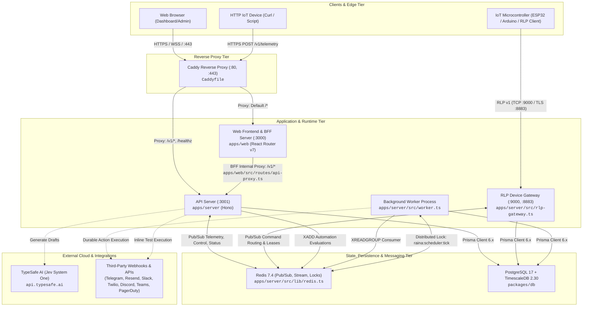
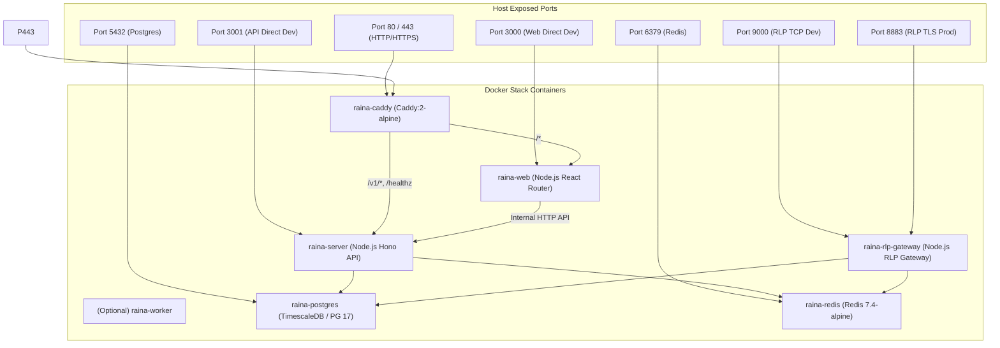

# System Architecture

เอกสารนี้อธิบายสถาปัตยกรรมระดับระบบของ **Raina** โดยอ้างอิงจากหลักฐานในโค้ด (Source-Grounded Evidence) เพื่อให้เห็นภาพโครงสร้างจริง การแบ่งแยกหน้าที่ (Separation of Concerns) และทิศทางการพึ่งพา (Dependency Direction)

---

## 1. System Overview & High-Level Architecture

Raina ได้รับการออกแบบเป็น Monorepo โดยแบ่งแยกระบบประมวลผลออกเป็น Runnable Units อิสระที่สามารถทำงานร่วมกันบนเครื่องเดียว (Single-host Homelab) หรือแยกคลัสเตอร์เพื่อรองรับโหลดสูง (Multi-instance Cluster) ผ่าน Redis และ Reverse Proxy

### High-Level Component Diagram



---

## 2. Architecture Goals ที่เห็นจาก Implementation

จากการวิเคราะห์ซอร์สโค้ดปัจจุบัน ระบบสะท้อนเป้าหมายเชิงสถาปัตยกรรมดังต่อไปนี้:
1. **Low-Latency Bidirectional IoT Transport**: ให้อุปกรณ์ฮาร์ดแวร์รายงานค่าและรับคำสั่งควบคุมผ่าน Binary Protocol เฉพาะ (**RLP v1**) โดยลด Bandwidth overhead และตัด dependency ของโพรโทคอลภายนอกอย่าง MQTT
2. **Resilient Realtime Dashboard Streaming**: หน้าจอแดชบอร์ดต้องแสดงผลแบบ Realtime ทันทีที่มี Telemetry เข้ามา โดยใช้ **WebSocket เป็นหลัก และ Fallback เป็น Server-Sent Events (SSE) อัตโนมัติ** เมื่อเครือข่ายบล็อก WebSocket
3. **Decoupled Stateless Scaling**: โพรเซส API (`apps/server`) สามารถสเกลหลาย Replicas ได้ โดยอาศัย Redis Pub/Sub กระจายอีเวนต์ และ Redis Streams ควบคุมการประเมิน Workflow ไม่ให้เกิด Duplicate Execution
4. **Durable & Checkpointed Automation Engine**: การทำงานของ Automation ถูกบันทึกสถานะทุกขั้นตอน (`AutomationRun` และ `AutomationStepRun`) มีการหน่วงเวลา (`AutomationDelay`) ที่ทนต่อการ Crash และสามารถ Resume ต่อได้
5. **Zero-Trust & Layered Access Control**: มีการแบ่ง Role ชัดเจน (`owner`, `admin`, `staff`, `client`), จำกัดสิทธิ์ระดับ Project และราย Dashboard (`DashboardAccess`), ควบคุมคำสั่ง Device Control อย่างเข้มงวด, และเข้ารหัสลับ Integration Secrets ด้วย AES-256-GCM ก่อนลงฐานข้อมูล

---

## 3. Monorepo Structure & Package Map

โปรเจกต์จัดการด้วย **pnpm workspaces** (`pnpm-workspace.yaml`):

```
raina/
├── apps/
│   ├── server/           # Hono API Server, RLP Gateway, Automation Runner, Worker
│   └── web/              # React Router v7 Frontend Web Application (SSR + BFF)
├── packages/
│   ├── db/               # Prisma ORM schema, migrations, Timescale setup, seeds
│   ├── rlp/              # Raina Link Protocol binary encoder/decoder/server
│   └── workflow/         # Workflow AST, Block catalog, Integration specs & executors
├── sdks/
│   └── arduino/          # Arduino / ESP32 C++ client library for RLP v1
├── deploy/               # Deployment scripts and systemd templates
├── docker/               # Docker configurations
└── scripts/              # Developer tools (e.g. emulator.ts)
```

### ตารางความสัมพันธ์ระหว่างโมดูล (Module Boundaries & Roles)

| แพ็กเกจ / โมดูล | ชนิด | หน้าที่ความรับผิดชอบ | Dependencies ภายใน Workspace |
| :--- | :--- | :--- | :--- |
| `@raina/db` | Shared Package | นิยาม Prisma schema, Client singleton, TimescaleDB hypertable setup, Seed script | ไม่มี (Leaf package) |
| `@raina/rlp` | Shared Package | ไบนารีเฟรมมิ่ง (Header 4 bytes), Type serializers, TCP/TLS Server implementation, Backpressure control | ไม่มี (Node native leaf package) |
| `@raina/workflow` | Shared Package | AST schemas, Block catalog definitions, pure conditions evaluator, 8 Integration handlers | ไม่มี |
| `@raina/server` | Application | REST endpoints, WebSocket handler, RLP Gateway daemon, Background scheduler, Redis adapter | `@raina/db`, `@raina/rlp`, `@raina/workflow` |
| `@raina/web` | Application | React UI, React Router v7 SSR, Dashboard grid, Widget registry, Canvas editor, BFF proxy | `@raina/server` (RPC Type only), `@raina/workflow` |
| `@raina/arduino` | SDK / C++ | Arduino/ESP32 C++ driver, WiFi multi-AP, RLP binary serializer, Dynamic handlers | ไม่มี |

---

## 4. Runtime Architecture & Processes

เมื่อรันระบบแบบเต็มรูปแบบตาม `docker-compose.yml` จะมีคอนเทนเนอร์และโพรเซสทำงานดังนี้:



### คำอธิบายโปรเซสแต่ละตัว

1. **API Server (`apps/server/src/index.ts`)**:
   - Entry point สำหรับ HTTP REST API ทั้งหมด
   - รองรับ WebSocket สำหรับ Dashboard clients (`/v1/dashboards/:id/ws`) โดยใช้ `upgradeWebSocket` จาก `@hono/node-ws` (`apps/server/src/lib/ws.ts`)
   - รองรับ HTTP Telemetry Ingestion (`POST /v1/telemetry`)
   - สตรีม SSE สำหรับ Dashboard (`/v1/dashboards/:id/stream`) และ Project Variables (`/v1/projects/:proj/variables/stream`)
   - หากรันแบบ Standalone และเปิด `SCHEDULER_ENABLED=true` โพรเซสนี้จะรัน `initScheduler()` ด้วย
2. **RLP Device Gateway (`apps/server/src/rlp-gateway.ts`)**:
   - รันแยกเป็นอิสระ (ใน Docker Compose คือเซอร์วิส `rlp-gateway`) โดยใช้คำสั่ง `node apps/server/dist/rlp-gateway.js`
   - เปิด TCP Socket (พอร์ต 9000) หรือ TLS Socket (พอร์ต 8883)
   - จัดการ Handshake ตรวจสอบ Project Token และ Device Key
   - บันทึก Lease การเชื่อมต่อของอุปกรณ์ลงใน Redis ด้วยคำสั่ง `claimLease()` (`raina:rlp:device:<deviceId>`) เพื่อให้ระบบรู้ว่าอุปกรณ์เชื่อมต่ออยู่ที่ Gateway โหนดใด
   - Subscribe ช่อง Redis `raina:rlp:commands` เพื่อรับคำสั่งจาก API ส่งต่อไปยังอุปกรณ์ผ่าน TCP Socket
3. **Background Worker (`apps/server/src/worker.ts`)**:
   - รันคำสั่ง `node apps/server/dist/worker.js` (สเกลได้อิสระ)
   - เชื่อมต่อ Redis Consumer Group `raina-automation-workers` บน Stream `raina:automation:evaluations`
   - รัน `initScheduler()` ซึ่งทำงานทุก 10 วินาที ผ่าน Distributed Lock `raina:scheduler:tick` เพื่อเช็ค Delay ที่ถึงกำหนด และ Schedule/Solar Triggers
   - รัน `purgeExpiredTelemetry()` รายชั่วโมงเมื่อไม่ได้เปิดใช้ TimescaleDB
4. **Web UI (`apps/web`)**:
   - รันเซิร์ฟเวอร์ React Router Node (`@react-router/serve ./build/server/index.js`) บนพอร์ต 3000
   - ทำหน้าที่ Server-Side Rendering (SSR) และเป็น Backend-for-Frontend (BFF)
   - ตัวรับ Session Cookie จากเบราว์เซอร์ แล้วแปลงเป็น `x-session-token` ส่งต่อให้ Backend API ผ่าน `apps/web/src/routes/api-proxy.ts`

---

## 5. Architectural Patterns ที่ใช้อยู่จริง

### 5.1 Backend-for-Frontend (BFF) & Reverse Proxy Pattern
- ฝั่ง Frontend (`apps/web`) มี Proxy Route Handler อยู่ที่ `apps/web/src/routes/api-proxy.ts` ทำหน้าที่รับ request path `/v1/*` จากหน้าบ้าน
- ดึง Session token จาก Cookie (รองรับทั้ง `__Host-raina_session` บน HTTPS และ `raina_session` บน HTTP) แล้วแนบเป็น HTTP Header `x-session-token` ส่งไปยัง Backend (`serverConfig.internalApiUrl`)
- ทำให้หน้าบ้านไม่ต้องจัดการเรื่อง CORS ระหว่าง Browser กับ API เมื่ออยู่ในระบบ Single-domain

### 5.2 Event-Driven Architecture (Dual Bus: In-Memory + Redis Pub/Sub)
- นำมาใช้ใน `apps/server/src/lib/events.ts`
- **Local Dev / Single Instance**: ใช้อินสแตนซ์ `eventBus` (`node:events EventEmitter`) ในการ Broadcast ภายในโพรเซส
- **Distributed Mode**: เมื่อ `REDIS_ENABLED=true` ระบบจะ Publish ไปยัง Redis Channel `raina:project:<projectId>:realtime` และให้ทุก Instance ที่ Subscribe `raina:project:*:realtime` รับไป Broadcast ต่อให้ Client ที่เกาะอยู่กับเครื่องนั้น โดยมี `source: instanceId` ป้องกันการสะท้อนข้อมูลกลับ (Echo Suppression)

### 5.3 Distributed Lock & Leases
- **RLP Device Leases**: ใน `apps/server/src/rlp-gateway.ts` ใช้ Redis Key `raina:rlp:device:<connectionId>` โดยต่ออายุ lease ทุกครึ่งหนึ่งของ `leaseMs` (ค่า default 45 วินาที) ทำให้สามารถส่ง Command ผ่าน Redis Pub/Sub ตรงไปยัง Gateway ตัวที่ถือ Socket ของอุปกรณ์ตัวนั้นอยู่
- **Scheduler Leader Election**: ใน `apps/server/src/services/scheduler.service.ts` ใช้ฟังก์ชัน `withDistributedLock("raina:scheduler:tick", 9000, tickScheduler)` ทำให้เมื่อรัน API หรือ Worker หลายตัว จะมีเพียงเครื่องเดียวที่ประมวลผล Scheduler ในแต่ละรอบ 10 วินาที

### 5.4 Durable Workflow Execution Pattern
- ใน `apps/server/src/lib/engine.ts` ฟังก์ชัน `executeAutomation` รองรับ Durable Execution:
  - สร้างเรคคอร์ด `AutomationRun` เมื่อเริ่มต้น
  - บันทึก `AutomationStepRun` ของแต่ละ Node ทันทีที่รันจบ (Checkpointing)
  - กรณีเกิด Crash หรือ Action ล้มเหลว สามารถ Resume จาก Node ที่ค้างอยู่ได้โดยข้าม Node ที่เคย `completed` ไปแล้ว (Idempotent Replay)
  - รองรับการ Pause ผ่าน Node `delay` โดยเซฟสถานะ Context ลงตาราง `AutomationDelay` และตั้งค่า `fireAt` เพื่อให้ Scheduler ปลุกขึ้นมาทำงานต่อ

### 5.5 Cryptographic Envelope Encryption for Secrets
- ใน `apps/server/src/lib/crypto.ts` ข้อมูลคอนฟิกของ Integrations (เช่น Bot Token, Webhook URLs, API Keys) จะถูกเข้ารหัสแบบ Envelope ก่อนบันทึกลงฐานข้อมูล:
  - อัลกอริทึม: **AES-256-GCM**
  - Key Derivation: **HKDF-SHA-256** ร่วมกับ Info string `raina/encrypt/integration-config` และ Master Secret (`ENCRYPTION_KEY` หรือ `JWT_SECRET`)
  - รูปแบบข้อมูลที่บันทึก: `v1:<base64_iv>:<base64_ciphertext>`

---

## 6. Cross-Cutting Concerns

| Concern | กลไกและไฟล์ Implementation |
| :--- | :--- |
| **Authentication** | `apps/server/src/lib/auth.ts` — ตรวจสอบ Session ผ่าน Cookie, Header `x-session-token`, หรือ WebSocket ticket |
| **Password Hashing** | `apps/server/src/modules/identity/identity.routes.ts` — ใช้ `crypto.scryptSync(password, salt, 64)` พร้อม Constant-time comparison |
| **Auditing** | `apps/server/src/lib/audit.ts` — ฟังก์ชัน `recordAudit()` บันทึกการเปลี่ยนแปลงสิทธิ์, Integrations, Device actions ลงตาราง `audit_log` |
| **Rate Limiting** | `apps/server/src/modules/identity/identity.routes.ts` — `checkLoginRateLimit()` จำกัด 10 ครั้ง/นาที ต่อ IP สำหรับ Endpoint เข้าสู่ระบบ |
| **Input Validation** | ใช้ `zod` และ `@hono/zod-validator` ในทุก API Route และ `packages/workflow/src/ast/types.ts` สำหรับ Graph validation |
| **Write Throttling** | `apps/server/src/services/telemetry.service.ts` — ฟังก์ชัน `shouldUpdateDeviceLastSeen()` ควบคุมการเขียน `device.lastSeen` ลง DB ไม่เกิน 1 ครั้งใน 30 วินาที เพื่อลด DB write contention |

---

## 7. Error Handling & Observability Architecture

1. **Server Global Error Handling**:
   - `apps/server/src/index.ts`: มี `app.onError((err, c) => ...)` ดักจับ Unhandled exceptions และแปลงเป็น JSON response `{ error, path }` พร้อม HTTP Status 500
   - `app.notFound((c) => ...)` แปลง 404 ให้เป็นมาตรฐาน
2. **Workflow Error Isolation**:
   - การรัน Action หรือ Condition แต่ละ Node ถูกห่อด้วย `try/catch`
   - ข้อผิดพลาดจะถูกบันทึกลง `AutomationStepRun.error` และสรุปลง `Automation.lastError` โดยไม่ทำให้ API Server แคช
   - Action ล้มเหลวสามารถ Retry อัตโนมัติด้วย Exponential Backoff + Jitter (`retryWithBackoff` ใน `apps/server/src/lib/engine.ts`)
3. **Observability & Diagnostics**:
   - Endpoint `GET /v1/admin/diagnostics` ใน `apps/server/src/modules/identity/identity.routes.ts` แสดงสถานะความหน่วงของ Database, สถานะ Redis Pub/Sub, ความยาวของ Automation Queue & Dead-letter Stream, จำนวนสถิติของ Project, Dashboards, Devices, Memory usage, Uptime
   - Endpoint `GET /healthz` สำหรับ Liveness / Readiness probe ของ Reverse proxy / Docker healthcheck

---

## 8. Architectural Limitations & Technical Debt ที่ตรวจพบ

1. **Redis Requirement for Device Downlink Commands**:
   - ใน `apps/server/src/lib/device-transport.ts` ฟังก์ชัน `publishDeviceCommand()` จะคืนค่า `false` ทันทีหาก `config.redisEnabled` เป็น `false`
   - **ผลกระทบ**: ในกรณีรันแบบ Local Dev หรือ Single-host ที่ไม่เปิด Redis ผู้ใช้จะไม่สามารถสั่งเปิด/ปิด Relay หรือส่งค่า Control ไปยังอุปกรณ์ไมโครคอนโทรลเลอร์ผ่าน RLP Gateway ได้ แม้อุปกรณ์จะต่ออยู่กับ Gateway บนเครื่องเดียวกันก็ตาม
2. **Dual-Route Registration (Legacy Aliases)**:
   - มีการประกาศ Route ซ้ำซ้อน เช่น `/v1/admin/projects/:proj/automations` และ `/v1/projects/:proj/automations` รวมทั้งแดชบอร์ด เพื่อรองรับโค้ดรุ่นเก่า
3. **In-Memory Login Rate Limiter**:
   - ตัวนับความพยายาม Login (`loginAttempts` ใน `apps/server/src/modules/identity/identity.routes.ts`) เก็บใน Memory Map (`Map<string, RateLimitEntry>`) ไม่ได้เก็บใน Redis ทำให้เมื่อสเกลหลายโพรเซส แต่ละโพรเซสจะมี Rate limit แยกจากกัน
