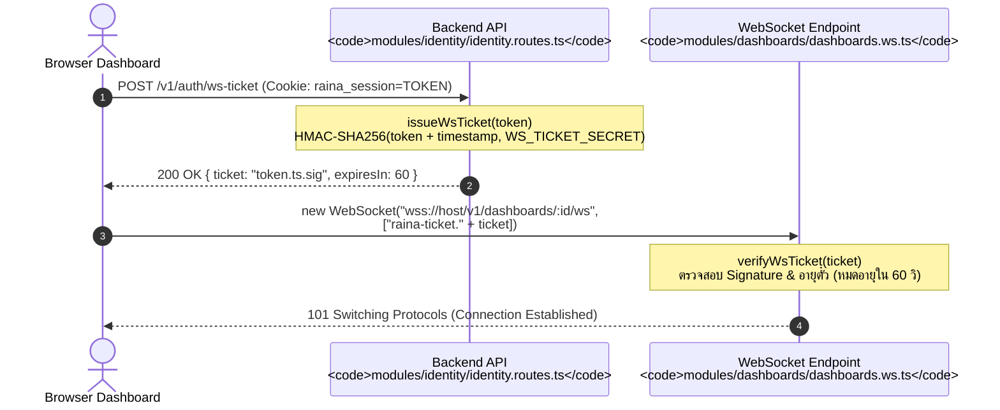

# Authentication & Authorization Architecture

เอกสารนี้วิเคราะห์ระบบความปลอดภัย การพิสูจน์ตัวตน (Authentication) และการควบคุมสิทธิ์การเข้าถึง (Authorization) ของ Raina โดยอ้างอิงจากหลักฐานในซอร์สโค้ด

---

## 1. Identity & Credential Model

ฐานข้อมูล Raina แยกส่วนของตัวตนผู้ใช้ออกเป็น 3 ตารางหลัก (`packages/db/prisma/schema.prisma`):

1. **`User` (ตาราง `users`)**:
   - เก็บข้อมูล Identity: `id` (cuid), `username` (unique), `email` (unique), `name`, `role`
   - Role พื้นฐาน: `owner`, `admin`, `staff`, `client`
2. **`Account` (ตาราง `accounts`)**:
   - รองรับ Multi-provider credentials (ปัจจุบันระบบใช้งาน `providerId: "credential"`)
   - เก็บ Hash ของรหัสผ่านในคอลัมน์ `password`
3. **`Session` (ตาราง `sessions`)**:
   - เก็บ Session Token ความยาว 64-character hex (`crypto.randomBytes(32).toString("hex")`)
   - ผูกกับ `userId`, มีอายุการใช้งาน 30 วัน (`expiresAt: now + 30 days`), เก็บ `ipAddress` และ `userAgent`

---

## 2. Password Hashing & Anti-Enumeration

Implementation อยู่ที่ `apps/server/src/modules/identity/identity.routes.ts`:

### 2.1 Password Hashing (`hashPassword`)
- **อัลกอริทึม**: `scryptSync` จาก Node.js `node:crypto`
- **Salt**: สุ่มขนาด 16 ไบต์ (32 hex characters) ต่อผู้ใช้หนึ่งคน
- **Key Length**: 64 ไบต์ (128 hex characters)
- **รูปแบบที่จัดเก็บใน DB**: `<salt>:<hash>` (เช่น `a1b2...:f4c8...`)

### 2.2 Constant-Time Comparison & Anti-Enumeration (`verifyPassword`)
- เพื่อป้องกัน **Timing Attack** ในการตรวจสอบว่ามี Username/Email ในระบบหรือไม่:
  - หากค้นหาผู้ใช้ไม่พบใน DB ระบบจะ **ไม่คืนค่าทันที** แต่จะนำรหัสผ่านที่ส่งมาไปคำนวณ `crypto.scryptSync(password, DUMMY_SALT, 64)` เทียบกับ `DUMMY_HASH` ด้วย `crypto.timingSafeEqual` เสมอ
  - ทำให้ระยะเวลาในการประมวลผลกรณี *User Not Found* และ *Wrong Password* มีระยะเวลาเท่ากัน ป้องกันผู้ไม่หวังดีทำ Username Enumeration

---

## 3. Session Model & Cookie Handling

### 3.1 รูปแบบคุกกี้ (`getSessionCookieHeader` / `apps/web/src/lib/bff-session.server.ts`)
- **ชื่อคุกกี้**:
  - เมื่อใช้งานผ่าน HTTPS: จะใช้ชื่อ Prefix ปลอดภัยสูงสุด **`__Host-raina_session`**
  - เมื่อใช้งานผ่าน HTTP (เช่น Local Development): จะใช้ชื่อ **`raina_session`**
- **คุณลักษณะ (Flags)**:
  - `HttpOnly`: ป้องกันไม่ให้ JavaScript ฝั่งเบราว์เซอร์อ่านค่า Token ได้ ป้องกันการขโมย Session ผ่าน XSS
  - `SameSite=Lax`: ป้องกัน CSRF สำหรับ Cross-site subrequests
  - `Path=/`: มีผลทั่วทั้งโดเมน
  - `Secure`: บังคับเปิดเมื่อคำขอเป็น HTTPS หรือรันในโหมด Production
  - `Max-Age=2592000` (30 วัน)

---

## 4. Authentication Flow (Sequence Diagram)

```mermaid
sequenceDiagram
    autonumber
    actor User as ผู้ใช้งาน (Browser)
    participant UI as Login Page<br/><code>routes/auth/login.tsx</code>
    participant BFF as Web Server BFF<br/><code>routes/auth/session.ts</code>
    participant Server as Hono Backend<br/><code>modules/identity/identity.routes.ts</code>
    participant DB as PostgreSQL (Prisma)

    User->>UI: กรอก Username/Email และ Password
    UI->>BFF: POST /auth/session { identifier, password }
    BFF->>Server: POST /v1/auth/sign-in
    
    Note over Server: checkLoginRateLimit(ip)<br/>(จำกัด 10 ครั้ง/นาที)
    Server->>DB: User.findFirst(username หรือ email)
    
    alt User Not Found
        Server->>Server: verifyPassword(password, null)<br/>(Dummy scrypt timing calculation)
        Server-->>BFF: 401 Invalid username/email or password
        BFF-->>UI: 401 Invalid credentials
    else User Found
        Server->>DB: Account.findFirst(userId, providerId="credential")
        Server->>Server: verifyPassword(password, account.password)
        alt Password Incorrect
            Server-->>BFF: 401 Invalid username/email or password
            BFF-->>UI: 401 Invalid credentials
        else Password Correct
            Server->>DB: Session.create(token=randomHex, expiresAt=+30d)
            Server->>DB: User.update(lastLoginAt=now)
            Server-->>BFF: 200 OK { user, token }
            Note over BFF: sessionCookie(token, request)
            BFF-->>UI: 200 OK { user }<br/>Set-Cookie: __Host-raina_session=token; HttpOnly; Secure
            UI->>User: Redirect เข้าสู่ /projects หรือแดชบอร์ด
        end
    end
```

---

## 5. WebSocket Authentication (Signed Tickets)

เนื่องจาก API มาตรฐานของ Browser `new WebSocket(url)` ไม่สามารถส่ง Custom Authorization Header ได้ และบางสภาพแวดล้อมมีปัญหากับการส่งคุกกี้ข้ามพอร์ต Raina จึงใช้สถาปัตยกรรม **WebSocket Ticket** (`apps/server/src/lib/ws-ticket.ts`):



---

## 6. Role-Based Access Control (RBAC) & Permissions

### 6.1 Platform Roles (`apps/server/src/lib/auth.ts`)
| Role | คำอธิบายระดับระบบ | สิทธิ์การเข้าถึง |
| :--- | :--- | :--- |
| **`owner`** | ผู้สร้างระบบคนแรก (สร้างผ่าน Bootstrap) | สิทธิ์สูงสุดในระบบ ไม่สามารถถูกลดสิทธิ์หรือลบได้หากเหลือเพียงคนเดียว |
| **`admin`** | ผู้ดูแลระบบ | จัดการ Staff, สร้าง/แก้ไข/ลบทุก Project, สร้าง Token, ควบคุมอุปกรณ์ทุกตัว |
| **`staff`** | เจ้าหน้าที่ปฏิบัติการ | ดูแลโปรเจกต์, แก้ไข Automation, จัดการแดชบอร์ด, ควบคุมอุปกรณ์ |
| **`client`** | ผู้ใช้ภายนอก / ลูกค้า | เข้าถึงเฉพาะโปรเจกต์ที่ได้รับเชิญ และแดชบอร์ดที่ได้รับมอบหมาย |

### 6.2 Project & Resource Level Permissions
- **Project Membership (`ProjectMember`)**: กำหนด Role ระดับโปรเจกต์ (`admin`, `member`, `client`) และแฟล็ก `accessAllDashboards`
- **Dashboard Access (`DashboardAccess`)**:
  - เมื่อ `accessAllDashboards: false` ผู้ใช้ระดับ `client` จะมองเห็นเฉพาะแดชบอร์ดที่มีเรคคอร์ดใน `dashboard_access`
  - มีแฟล็ก `canControl: boolean` ควบคุมว่าผู้ใช้คนนั้นสามารถกดปุ่มสั่งการ (Downlink Control) บนแดชบอร์ดนั้นได้หรือไม่
- **Hardware Tokens (`ProjectToken`)**:
  - อุปกรณ์ IoT สื่อสารผ่าน Token ที่สร้างขึ้นในแต่ละโปรเจกต์
  - บันทึกในฐานข้อมูลเป็นค่า **SHA-256 Hash** (`hash: sha256(rawToken)`) ค่าดิบจะแสดงให้ผู้ใช้เห็นเพียงครั้งเดียวตอนสร้าง
  - มีฟิลด์ `revokedAt` สำหรับเพิกถอน Token ทันที
