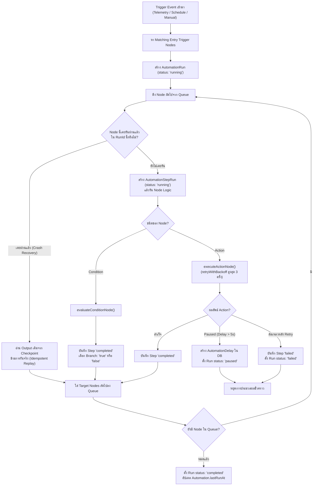

# Automation & Workflow Engine

เอกสารนี้วิเคราะห์เครื่องยนต์ประมวลผล Workflow Automation ของ Raina ครอบคลุมโครงสร้าง Graph AST, กลไก Durable Execution, ตัวประเมินเงื่อนไข, Action Executors, และระบบ AI Draft Generation

---

## 1. Workflow Model & Graph AST

Workflow ใน Raina ถูกแทนด้วย **Directed Acyclic Graph (DAG)** นิยามผ่าน Zod Schemas ใน `packages/workflow/src/ast/types.ts`:

- **`GraphNode`**:
  ```ts
  {
    id: string;        // เช่น "node_1", "step_trigger"
    kind: string;      // ชนิดของบล็อก (เช่น "variable", "if_variable", "set_variable")
    config: Record<string, unknown>; // ค่าการตั้งค่าของบล็อก
    x?: number;        // ตำแหน่งพิกัดบน Canvas
    y?: number;
  }
  ```
- **`GraphEdge`**:
  ```ts
  {
    from: string;      // Source Node ID
    to: string;        // Target Node ID
    port?: string;     // Port ขาออก เช่น "out", "true", "false", "yes", "no"
  }
  ```
- **`AutomationGraph`**: `{ nodes: GraphNode[], edges: GraphEdge[] }`

### Graph Validation (`packages/workflow/src/blocks/index.ts` — `graphError`)
ก่อนการบันทึกหรือรัน ระบบจะตรวจสอบความถูกต้องของโครงสร้าง:
1. ต้องมี Trigger Node อย่างน้อยหนึ่งตัว
2. ห้ามมีวงรอบ (Cycle Detection): ตรวจสอบว่าต้องเป็น Directed Acyclic Graph (DAG) เท่านั้น
3. ตรวจสอบ Required fields ของแต่ละ Block ตาม Manifest ใน Catalog

---

## 2. Block Catalog (Triggers, Conditions, Actions)

บล็อกทั้งหมดถูกจัดหมวดหมู่ไว้ใน `packages/workflow/src/blocks/`:

### 2.1 Triggers (จุดเริ่มต้นการทำงาน)
| Kind | คำอธิบาย | พารามิเตอร์สำคัญ | Event Source |
| :--- | :--- | :--- | :--- |
| **`variable`** / **`variable_changed`** | ทำงานเมื่อค่าตัวแปรของเซนเซอร์เปลี่ยน หรือข้ามเกณฑ์ที่กำหนด | `variable`, `operator` (`>`, `<`, `==`, `!=`, `changed`), `value`, `cooldown_seconds`, `device` | `telemetry`, `control` |
| **`schedule`** | ทำงานตามเวลาประจำวัน หรือวันที่ระบุในสัปดาห์ | `time` (HH:MM), `days` (0-6), `tz` (Timezone) | `schedule` (Scheduler Tick) |
| **`sunset_sunrise`** | ทำงานตามพระอาทิตย์ขึ้นหรือตกดิน | `event` (`sunrise` [06:00] / `sunset` [18:00]), `offset_minutes` | `schedule` (Scheduler Tick) |
| **`event`** | ทำงานเมื่อเกิดอีเวนต์ภายในที่ระบุชื่อ | `event` (ชื่ออีเวนต์) | `event` |
| **`manual`** | ทำงานเมื่อผู้ใช้กดสั่งรันเองจาก UI หรือ API | — | `manual` |

### 2.2 Conditions (การแยกกิ่งการตัดสินใจ)
| Kind | Output Ports | การประเมินผล |
| :--- | :--- | :--- |
| **`if_variable`** | `true`, `false` | เปรียบเทียบค่าของตัวแปรใน Context หรืออ่านจาก DB ล่าสุดด้วย Operator (`>`, `<`, `>=`, `<=`, `==`, `!=`) ผ่าน `evaluateOperator` |
| **`time_window`** | `true`, `false` | ตรวจสอบว่าเวลาปัจจุบันอยู่ในช่วงที่กำหนดหรือไม่ (รองรับ Overnight Window เช่น `22:00` ถึง `06:00` และกำหนด Timezone ได้) |

### 2.3 Actions (การกระทำที่สั่งการ)
| Kind | พารามิเตอร์สำคัญ | พฤติกรรมจริงในเซิร์ฟเวอร์ (`apps/server/src/lib/automation-action-executors.ts`) |
| :--- | :--- | :--- |
| **`set_variable`** | `variable`, `value`, `device` | 1. Interpolate ข้อความ<br/>2. Upsert ลง `project_variables`<br/>3. ส่งคำสั่ง `publishDeviceCommand()` ไปยัง RLP Gateway<br/>4. สตรีม `broadcastTelemetry()` ไปยังแดชบอร์ด<br/>5. ตรวจสอบ Cascade Loop (จำกัด `depth < 5`) |
| **`call_integration`** | `integration_id`, `operation`, `params` | 1. ค้นหาและถอดรหัสลับคอนฟิก<br/>2. เรียก `executeIntegration()`<br/>3. รองรับ Retry อัตโนมัติ 3 ครั้ง<br/>4. อัปเดตสถานะในตาราง `integrations` |
| **`emit_event`** | `event` | 1. Broadcast อีเวนต์ `automation_event`<br/>2. ทริกเกอร์ Automation อื่นที่รออีเวนต์นี้อยู่ (จำกัด `depth < 3`) |
| **`delay`** | `delay_amount`, `delay_unit` | - หากดีเลย์ <= 5 วินาที หรือเป็นการรัน Manual: รอแบบ In-process (inline timeout)<br/>- หากดีเลย์ > 5 วินาที: บันทึกสถานะลงตาราง `AutomationDelay` และสั่ง Pause ตัวรันเพื่อคืนทรัพยากร |

---

## 3. Durable Execution Engine Architecture

เครื่องยนต์ใน `apps/server/src/lib/engine.ts` (`executeAutomation`) มีคุณสมบัติ **Durable Execution**:



---

## 4. Delay Resumption & Scheduler Service

เมื่อมี Node ชนิด `delay` นานกว่า 5 วินาที:
1. Engine จะบันทึกเรคคอร์ดลงในตาราง `AutomationDelay` (`packages/db/prisma/schema.prisma`):
   - `resumeNodeId`: ID ของ Node ปลายทางที่จะทำต่อ
   - `ctx`: JSON Snapshot ของ AutomationContext ณ ขณะนั้น
   - `fireAt`: เวลา Unix Milliseconds ที่ถึงกำหนดปลุก
2. เซอร์วิส `apps/server/src/services/scheduler.service.ts` ทำงานวนรอบทุก 10 วินาที ผ่าน Distributed Lock:
   - ค้นหา `AutomationDelay.findMany({ where: { fireAt: { lte: now } } })`
   - เรียก `executeAutomation()` อีกครั้ง โดยส่ง `options.startNodeId = delay.resumeNodeId` และ `options.runId = delay.runId`
   - ลบเรคคอร์ด Delay ออกจาก DB เมื่อเริ่มประมวลผล

---

## 5. Natural Language Draft Generation (TypeSafe AI)

ตั้งอยู่ที่ `apps/server/src/modules/automations/automation-draft.service.ts`:

- **โมเดล AI**: TypeSafe AI Jev Model (`api.typesafe.ai/v1/systemone`, `model: "jev-latest"`)
- **การทำงานอย่างปลอดภัย (Zero-Hallucination Guardrails)**:
  - เซิร์ฟเวอร์ **ไม่ส่ง Prompt ไปให้ LLM สร้าง Graph หรือ Code เองแบบอิสระ**
  - เซิร์ฟเวอร์ส่งเฉพาะรายชื่อตัวแปรจริง (`variables`) และรายชื่อ Integration จริง (`integrations`) ในโปรเจกต์ของผู้ใช้ไปเป็นตัวเลือก (Bounded Semantic Choice Questions)
  - โมเดล Jev จะตอบเฉพาะตัวเลือกที่มั่นใจ (Confidence >= 0.3, Probability >= 0.5)
  - ซอร์สโค้ดของ Raina เป็นผู้ประกอบ Node และ Edge เข้าด้วยกันเองตามผลลัพธ์ที่แมปได้
  - ป้องกันการหลอนสร้างอุปกรณ์ที่ไม่มีอยู่จริง และร่างที่ได้จะถูกตั้งค่า `enabled: false` เสมอ เพื่อให้ผู้ใช้ตรวจสอบและเปิดใช้งานด้วยตนเอง
