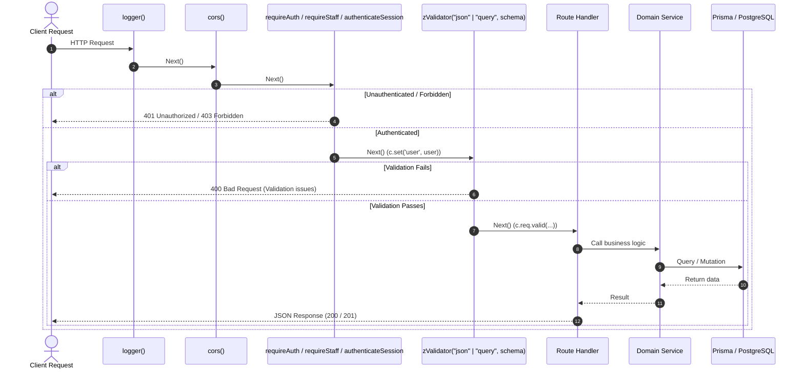

# Backend Architecture (`apps/server`)

เอกสารนี้วิเคราะห์สถาปัตยกรรมของแอปพลิเคชันฝั่งหลังบ้าน (`apps/server`) โดยอิงตามโค้ดจริงที่ทำงานอยู่

---

## 1. Backend Framework & Entry Points

Backend ของ Raina พัฒนาด้วย **Hono** (`hono` 4.7.x) บน Node.js runtime โดยใช้ `@hono/node-server` และ `@hono/node-ws`

### Application Entry Points

| Entry File | คำสั่งรัน | หน้าที่ความรับผิดชอบ |
| :--- | :--- | :--- |
| `src/index.ts` | `node dist/index.js` หรือ `pnpm dev` | เริ่มต้น HTTP REST Server, WebSocket handler, In-process Realtime Bus, และ Scheduler (หากเปิด) บนพอร์ต 3001 |
| `src/rlp-gateway.ts` | `node dist/rlp-gateway.js` | เริ่มต้น RLP Binary Socket Server (TCP: 9000, TLS: 8883) เชื่อมต่ออุปกรณ์ไมโครคอนโทรลเลอร์ และรับ Command ผ่าน Redis |
| `src/worker.ts` | `node dist/worker.js` | เริ่มต้น Background Worker สำหรับบริโภค Redis Streams (`raina:automation:evaluations`) และรัน Timers ประจำรอบ |

---

## 2. Route Registration & Typesafe Export

ใน `apps/server/src/index.ts` ระบบแยก **Route Definition Chain** ออกจาก Runtime Middleware อย่างชัดเจน:

```ts
// apps/server/src/index.ts
const api = new Hono()
  .get("/healthz", (c) => c.json({ ok: true, timestamp: Date.now() }))
  .get("/v1/version", (c) => c.json({ name: "raina", version: "1.0.0", stack: "hono+prisma+rlp" }))
  .route("/v1", identityRouter)
  .route("/v1", projectsRouter)
  .route("/v1", projectUsersRouter)
  .route("/v1", variablesRouter)
  .route("/v1", devicesRouter)
  .route("/v1", dashboardsRouter)
  .route("/v1", telemetryRouter)
  .route("/v1", automationsRouter)
  .route("/v1", integrationsRouter);

export type AppType = typeof api;
```

> **หมายเหตุ**: `export type AppType = typeof api` ถูกนำไปใช้ฝั่งหน้าบ้าน (`apps/web/src/lib/api-client.ts`) เพื่อสร้าง Hono RPC Client (`hc<AppType>`) ทำให้การเรียก API ฝั่งหน้าบ้านมี Type Safety ตลอดกระบวนการ (End-to-End Type Safety)

---

## 3. Middleware & Request Lifecycle



### รายละเอียด Middleware สำคัญ (`apps/server/src/lib/auth.ts`)
1. **`authenticateSession(c: Context)`**:
   - ตรวจหา Session token จาก:
     1. WebSocket Subprotocol Header: `Sec-WebSocket-Protocol: raina-ticket.<ticket>` (ตรวจสอบด้วย `verifyWsTicket` ใน `apps/server/src/lib/ws-ticket.ts`)
     2. Custom Header: `x-session-token`
     3. Header มาตรฐาน: `Authorization: Bearer <token>`
     4. Cookie: `raina_session=<token>` หรือ `__Host-raina_session=<token>`
   - ค้นหาในตาราง `Session` ร่วมกับ `User` ในฐานข้อมูล และตรวจ `expiresAt > now`
2. **`requireAuth`**: บังคับว่าต้องมี Session ที่ยังไม่หมดอายุ มิฉะนั้นส่งกลับ `401 Unauthorized`
3. **`requireStaff`**: ตรวจสอบว่า Role ของ User ต้องอยู่ในกลุ่ม `["owner", "admin", "staff"]` มิฉะนั้นส่งกลับ `403 Forbidden`
4. **`requireAdmin`**: ตรวจสอบว่า Role ของ User ต้องเป็น `["owner", "admin"]`
5. **`requireOwner`**: ตรวจสอบว่า Role ของ User ต้องเป็น `["owner"]` เท่านั้น
6. **`bodyLimit`**: ใน `apps/server/src/modules/telemetry/telemetry.routes.ts` มีการจำกัดขนาด Telemetry JSON Payload ไม่เกิน 64 KB ป้องกัน DoS

---

## 4. Domain Services & Responsibilities

| โมดูล / เซอร์วิส | ไฟล์ Implementation | หน้าที่ความรับผิดชอบ |
| :--- | :--- | :--- |
| **Telemetry Ingestion** | `services/telemetry.service.ts` — `processTelemetryPayload` | ตรวจสอบ Device, Sanitized Timestamp, Batch insert ลง `telemetry`, Upsert ลง `project_variables`, Broadcast realtime, Enqueue automation |
| **Telemetry Module** | `modules/telemetry/telemetry.service.ts` | Authenticate Device Token (SHA-256), Execute Control, Query History |
| **Automation Queue** | `lib/automation-queue.ts` | Enqueue ลง Redis Streams `raina:automation:evaluations` หรือ Fallback รัน In-process |
| **Workflow Engine** | `lib/engine.ts` — `executeAutomation` | ตรวจสอบ Trigger, รัน Graph ตามลำดับ, บันทึก Checkpoint แต่ละ Step, รองรับ Retry, Delays |
| **Background Scheduler** | `services/scheduler.service.ts` | ปลุก Delay ที่ถึงกำหนด, ตรวจสอบ Schedule & Solar Triggers, สั่ง Purge ข้อมูล Telemetry เก่า |
| **Device Transport** | `lib/device-transport.ts` — `publishDeviceCommand` | ส่งคำสั่ง Downlink ผ่าน Redis Pub/Sub `raina:rlp:commands` ไปยัง RLP Gateway |
| **Dashboard Series** | `modules/dashboards/dashboard-series.service.ts` | ดึงข้อมูลย้อนหลัง 300 จุดต่อตัวแปรด้วย SQL Window Function พร้อม Redis Cache 15 วินาที |
| **Crypto Manager** | `lib/crypto.ts` | ตราประทับและถอดรหัส Integration secrets ด้วย HKDF-AES-256-GCM |
| **TypeSafe AI Draft** | `modules/automations/automation-draft.service.ts` | ยิง API ไปยัง `api.typesafe.ai` (Jev Model) เพื่อแปลงข้อความเป็น Graph Draft |

---

## 5. Trace ตัวอย่าง Major API Flow (Control Device Flow)

เมื่อผู้ใช้กดสวิตช์เปิด/ปิดอุปกรณ์บนแดชบอร์ด:

1. **HTTP Entry Point**: `POST /v1/control` ใน `apps/server/src/modules/telemetry/telemetry.routes.ts` (`handleControl`)
2. **Authentication & Authorization**:
   - `authenticateSession(c)` ตรวจสอบผู้ใช้
   - `verifyControlPermission(user.id, user.role, projectId)` ใน `apps/server/src/lib/auth.ts`:
     - หากเป็น Staff/Admin/Owner ผ่านทันที
     - หากเป็น Client ตรวจสอบ `accessAllDashboards` หรือค่า `canControl: true` ในตาราง `dashboard_access`
3. **Execution (`telemetryModuleService.executeControl`)**:
   - หาหรือสร้าง ID อุปกรณ์ผ่าน `getOrCreateDefaultDevice()`
   - Upsert ค่าล่าสุดลงตาราง `ProjectVariable`
   - หากเป็นตัวเลข ทำการบันทึกลงตาราง `Telemetry`
   - สั่งส่งคำสั่งไปยังฮาร์ดแวร์: เรียก `publishDeviceCommand()` ใน `apps/server/src/lib/device-transport.ts` ซึ่ง Publish JSON Envelope ลง Redis Channel `raina:rlp:commands`
   - กระจายอีเวนต์ Realtime: เรียก `broadcastControl()` ใน `apps/server/src/lib/events.ts`
   - ประเมิน Automation: เรียก `enqueueAutomationEvaluation()` ใน `apps/server/src/lib/automation-queue.ts`
4. **Hardware Dispatch**:
   - `apps/server/src/rlp-gateway.ts` ได้รับข้อความจาก Redis
   - ตรวจสอบว่าตนเองถือ Lease ของอุปกรณ์ตัวนั้นหรือไม่ (`ownsLease(message.connectionId)`)
   - เรียก `rlp.command(connectionId, { channel, valueType, value })` ส่ง Binary Frame ชนิด `COMMAND` (Type 5) ผ่าน TCP Socket ออกไปยังฮาร์ดแวร์ทันที
