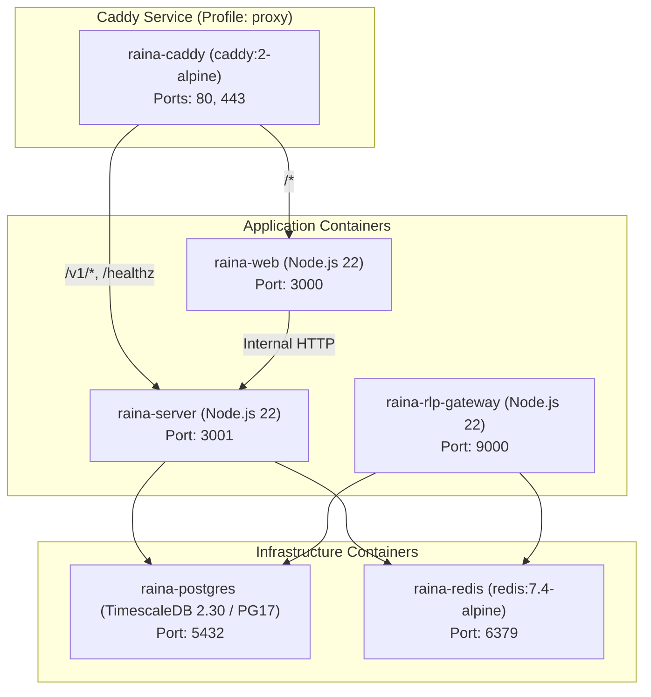

# Deployment & Operations Guide

เอกสารนี้อธิบายสถาปัตยกรรมและขั้นตอนการนำ Raina ไปติดตั้งใช้งานจริง (Deployment) โดยอ้างอิงจากหลักฐานของคอนฟิกใน Repository

---

## 1. Deployment Topologies

Repository รองรับการติดตั้ง 2 รูปแบบหลัก:

| รูปแบบ | สภาพแวดล้อมที่เหมาะสม | ไฟล์ควบคุมหลัก |
| :--- | :--- | :--- |
| **All-in-One Docker Stack (แนะนำ)** | VPS ทั่วไป (Hetzner, DigitalOcean, AWS, Linode) หรือ Homelab (Mini PC, Proxmox, Unraid) | `docker-compose.yml`, `Caddyfile` |
| **Native systemd Services** | Linux ขนาดเล็ก (Low-RAM / Single-board Computer) ที่ต้องการตัด Container Runtime Overhead | `deploy/native/install.sh`, `deploy/native/*.service` |

---

## 2. Docker Compose Deployment

โครงสร้างบริการใน `docker-compose.yml`:



### 2.1 Services & Healthchecks

1. **`postgres`**:
   - อิมเมจ: `timescale/timescaledb:2.30.0-pg17`
   - Command: `postgres -c shared_preload_libraries=timescaledb`
   - Healthcheck: `pg_isready -U raina -d raina` (Interval 5s, Retries 5)
   - Volume: `postgres_data:/var/lib/postgresql/data`
2. **`redis`**:
   - อิมเมจ: `redis:7.4-alpine`
   - Command: `redis-server --appendonly yes`
   - Healthcheck: `redis-cli ping` (Interval 5s, Retries 10)
   - Volume: `redis_data:/data`
3. **`server`**:
   - Dockerfile: `apps/server/Dockerfile`
   - Entrypoint Script: `apps/server/scripts/entrypoint.sh` (สั่งรัน `prisma db push` และ `timescale.ts` อัตโนมัติเมื่อ `AUTO_MIGRATE=true`)
   - พอร์ต: `3001:3001`
   - ขึ้นตรงกับ: `postgres` และ `redis` (รอจนกว่าสถานะเป็น Healthy)
4. **`rlp-gateway`**:
   - Dockerfile: ใช้ร่วมกับ `apps/server/Dockerfile`
   - Command: `node apps/server/dist/rlp-gateway.js`
   - พอร์ต: `9000:9000`
5. **`web`**:
   - Dockerfile: `apps/web/Dockerfile`
   - Arg: `INTERNAL_API_URL=http://server:3001`
   - พอร์ต: `3000:3000`
6. **`caddy` (Profile: `proxy`)**:
   - อิมเมจ: `caddy:2-alpine`
   - พอร์ต: `80:80`, `443:443`
   - Volume: `./Caddyfile:/etc/caddy/Caddyfile:ro`, `caddy_data:/data`, `caddy_config:/config`

---

## 3. Reverse Proxy Architecture (`Caddyfile`)

Caddy ทำหน้าที่เป็น Single Public Entry Point รองรับการออกใบรับรอง Let's Encrypt อัตโนมัติ:

```caddy
{$DOMAIN::80} {
    # Backend REST API & WebSocket Streaming
    handle /v1/* {
        reverse_proxy server:3001
    }

    # Health check probe
    handle /healthz {
        reverse_proxy server:3001
    }

    # Frontend Web UI
    handle {
        reverse_proxy web:3000
    }
}
```

> **ข้อสังเกตสำคัญ**: สำหรับการสื่อสารผ่านฮาร์ดแวร์ RLP ผ่านพอร์ต TLS `8883` การเชื่อมต่อจะวิ่งตรงเข้าสู่ `rlp-gateway` โดยไม่อ้อมผ่าน Caddy เนื่องจาก RLP เป็น Binary TCP ไม่ใช่ HTTP

---

## 4. Network Ports Reference

| พอร์ต | โปรโตคอล | เซอร์วิสเป้าหมาย | ความจำเป็นในการเปิดสู่สาธารณะ |
| :--- | :--- | :--- | :--- |
| **80** | TCP | Caddy | จำเป็นสำหรับ HTTP และการยืนยัน Let's Encrypt ACME challenge |
| **443** | TCP | Caddy | จำเป็นสำหรับ HTTPS Dashboard และ Secure WebSockets (`wss://`) |
| **9000** | TCP | RLP Gateway | เฉพาะ Local Development หรือ Private LAN (ไม่แนะนำให้เปิดบน Internet) |
| **8883** | TCP (TLS) | RLP Gateway | **จำเป็นต้องเปิด** หากมีอุปกรณ์ภายนอกเชื่อมต่อ RLP v1 ผ่าน TLS |
| **3000** | TCP | Web Frontend | ควรปิดเป็น Private (เข้าผ่าน Caddy แทน) |
| **3001** | TCP | Server API | ควรปิดเป็น Private (เข้าผ่าน Caddy แทน) |
| **5432** | TCP | PostgreSQL | ห้ามเปิดสู่สาธารณะ (ควรจำกัดเฉพาะภายใน Docker Network หรือ Localhost) |
| **6379** | TCP | Redis | ห้ามเปิดสู่สาธารณะ (ควรจำกัดเฉพาะภายใน Docker Network หรือ Localhost) |

---

## 5. Build & Startup Commands

### ลำดับการ Build ภายใน Monorepo
ลำดับการ Build ถูกระบุไว้อย่างชัดเจนใน `package.json`:
```bash
pnpm --filter @raina/workflow build && \
pnpm --filter @raina/rlp build && \
pnpm --filter @raina/db build && \
pnpm --filter @raina/server build && \
pnpm --filter @raina/web build
```

### Production Runtime Commands
- **API Server**: `node apps/server/dist/index.js`
- **RLP Gateway**: `node apps/server/dist/rlp-gateway.js`
- **Background Worker**: `node apps/server/dist/worker.js`
- **Web Frontend**: `PORT=3000 react-router-serve ./build/server/index.js`

---

## 6. ข้อสังเกตและจุดขัดแย้งเกี่ยวกับ EMQX / MQTT

- ในเอกสารเดิม `deploy/native/README.md` มีการกล่าวถึงการติดตั้ง **EMQX 5** ร่วมกับไฟล์ `deploy/native/emqx-raina.hocon`
- **ความจริงจากโค้ดปัจจุบัน**:
  - ไดเรกทอรี `docker/emqx/` มีอยู่จริงแต่เป็นโฟลเดอร์ว่างเปล่า (0 entries)
  - `docker-compose.yml` ไม่มี Service EMQX หรือ MQTT Broker ใด ๆ
  - ฮาร์ดแวร์และเซิร์ฟเวอร์ในเวอร์ชันปัจจุบันสื่อสารผ่าน **RLP v1 (Raina Link Protocol)** บนพอร์ต 9000/8883 แทนการพึ่งพา MQTT
  - ดังนั้น การ Deploy ใหม่ไม่จำเป็นต้องติดตั้ง EMQX
