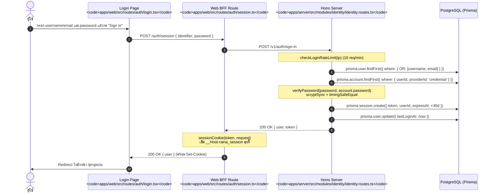
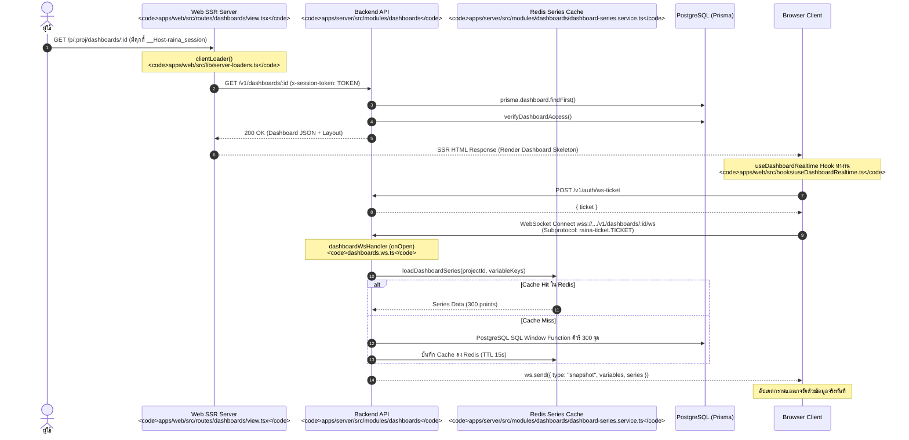
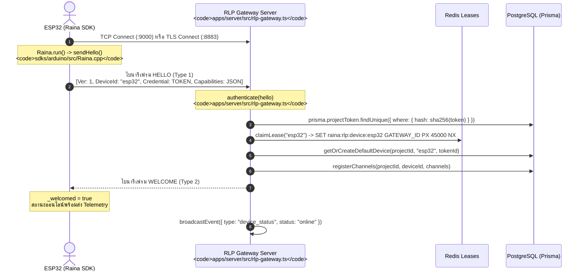
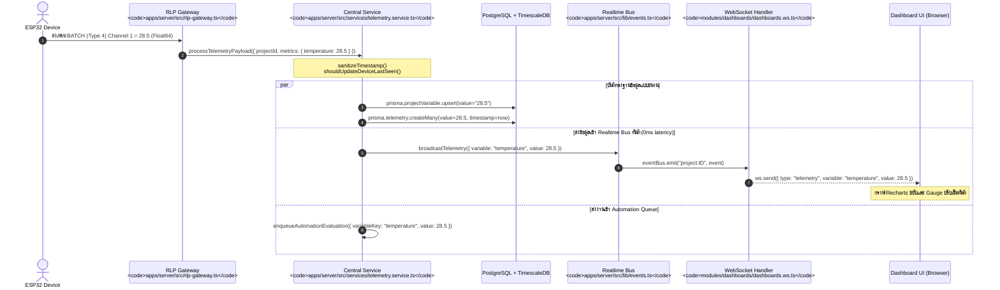
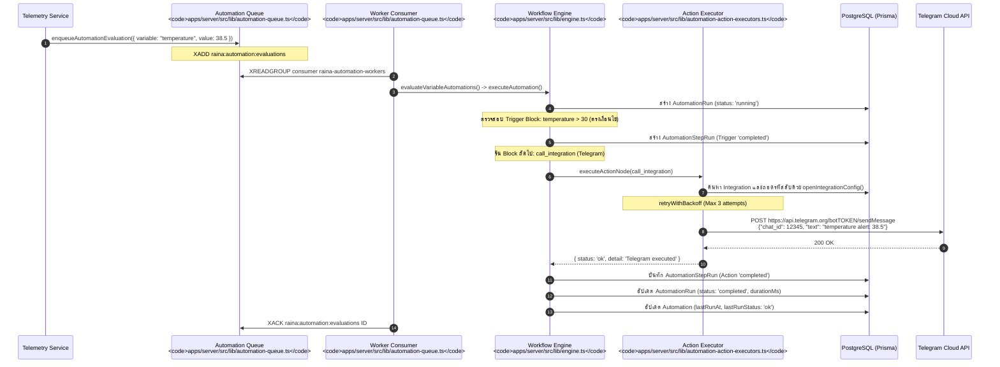

# Representative Execution Flows

เอกสารนี้รวบรวมและ Trace ลำดับการทำงาน (Execution Flows) ที่สำคัญที่สุด 9 รายการของ Raina ตั้งแต่ Entry Point ผ่าน Function, Class, Service, Database จนถึงปลายทางจริง โดยอ้างอิง Symbol และ Repo-relative File Path อย่างแม่นยำ

---

## Flow 1: User Login (การเข้าสู่ระบบของผู้ใช้)

1. **Entry Point**: `apps/web/src/routes/auth/login.tsx` — Event Handler `handleSubmit`
2. **BFF Endpoint**: `apps/web/src/routes/auth/session.ts` — ฟังก์ชัน `action` ส่งต่อไปยัง Backend
3. **Backend Route**: `apps/server/src/modules/identity/identity.routes.ts` — ฟังก์ชัน `handleSignIn`
4. **Rate Limiting**: `checkLoginRateLimit(ip)` ป้องกัน Brute-force
5. **Credential Verification**: `verifyPassword` เปรียบเทียบ Scrypt Hash ด้วย Constant-Time
6. **Session Creation**: `prisma.session.create` บันทึก Session Token สุ่ม 64 ตัวอักษร
7. **Cookie Packaging**: `sessionCookie` ใน `apps/web/src/lib/bff-session.server.ts` กำหนดค่า `HttpOnly`, `SameSite=Lax`, `Secure`
8. **Final State**: ผู้ใช้เข้าสู่ระบบสำเร็จ คุกกี้ถูกบันทึกในเบราว์เซอร์

---

## Flow 2 & 3: User Opens Dashboard & Loads Data (เปิดแดชบอร์ดและโหลดข้อมูล)

1. **Entry Point**: ผู้ใช้เรียก URL `/p/:proj/dashboards/:id`
2. **SSR Loader**: `clientLoader` ใน `apps/web/src/routes/dashboards/view.tsx` เรียก `getDashboard()`
3. **Backend Resolver**: `getDashboardById` ใน `apps/server/src/modules/dashboards/dashboards.routes.ts`
4. **WebSocket Connect**: `useDashboardRealtime` ใน `apps/web/src/hooks/useDashboardRealtime.ts` ขอตั๋วและเปิด WebSocket
5. **Series Query**: `loadDashboardSeries` ใน `apps/server/src/modules/dashboards/dashboard-series.service.ts` คิวรี่ฐานข้อมูลและเช็คแคช Redis
6. **Snapshot Delivery**: ส่งก้อน JSON Snapshot เข้ามาทาง Socket และ Recharts/WidgetDispatcher แสดงผลบนหน้าจอ

---

## Flow 4: Device Connects to System (อุปกรณ์เชื่อมต่อผ่าน RLP)

1. **Entry Point**: ไมโครคอนโทรลเลอร์บูตขึ้นมา เรียก `Raina.begin()` และ `Raina.run()` ใน `sdks/arduino/src/Raina.cpp`
2. **RLP Framing**: `sendHello()` ส่ง Packet ชนิด `HELLO` (Type 1)
3. **Gateway Verification**: `authenticate()` ใน `apps/server/src/rlp-gateway.ts` ตรวจสอบ Token Hash
4. **Distributed Lease**: `claimLease()` ใน Redis ผูกอุปกรณ์เข้ากับ Gateway ID ปัจจุบัน
5. **Channel Registration**: `registerChannels()` ผูกเลข Channel ตัวเลขเข้ากับชื่อตัวแปรใน DB
6. **Handshake Completion**: Gateway ตอบกลับเฟรม `WELCOME` และกระจายสถานะ `online` เข้า Realtime Bus

---

## Flow 5, 6 & 7: Telemetry Ingested, Persisted, and Delivered Realtime

1. **Entry Point**: ข้อมูลเซนเซอร์ถูกส่งเข้ามาผ่าน RLP Socket หรือ `POST /v1/telemetry`
2. **Central Processing**: `processTelemetryPayload()` ใน `apps/server/src/services/telemetry.service.ts`
3. **Data Persistence**:
   - `ProjectVariable.upsert`: บันทึกค่าล่าสุดสำหรับ State แสดงผล
   - `Telemetry.createMany`: บันทึกลง TimescaleDB Hypertable
4. **Realtime Fan-out**: `broadcastTelemetry()` ใน `apps/server/src/lib/events.ts` ส่งไปยัง WebSocket และ SSE ของเบราว์เซอร์
5. **UI Rendering**: วิดเจ็ต `IotValue`, `IotGauge`, `IotChart` บนแดชบอร์ดอัปเดตแบบไร้รอยต่อ

---

## Flow 8 & 9: Automation Triggered and Integration Executed

1. **Trigger Phase**: ค่าอุณหภูมิใหม่ทำให้เกิดการเรียก `enqueueAutomationEvaluation()`
2. **Queueing**: ส่งเข้า Redis Streams `raina:automation:evaluations`
3. **Execution**: Worker ดึงงานและเรียก `executeAutomation()` ใน `apps/server/src/lib/engine.ts`
4. **Step Checkpointing**: บันทึกสถานะแต่ละก้าวลงตาราง `AutomationStepRun`
5. **Integration Invocation**: `callIntegration` ใน `apps/server/src/lib/automation-action-executors.ts` ถอดรหัสลับและส่งข้อความแจ้งเตือนผ่าน Telegram API จริง
6. **Run Completion**: ปิดรอบการรันด้วยสถานะ `completed` และยืนยัน ACK ใน Redis Streams
