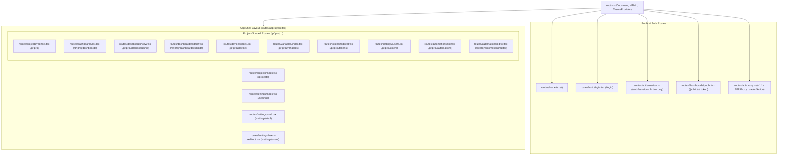
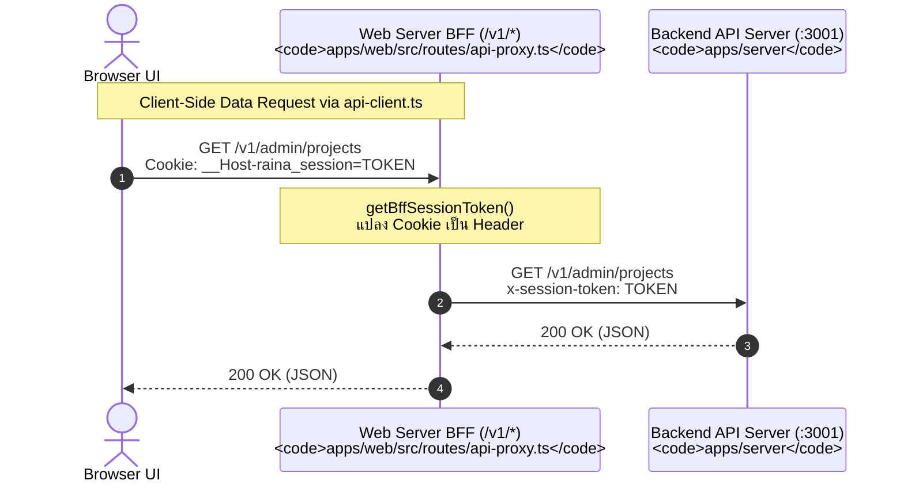
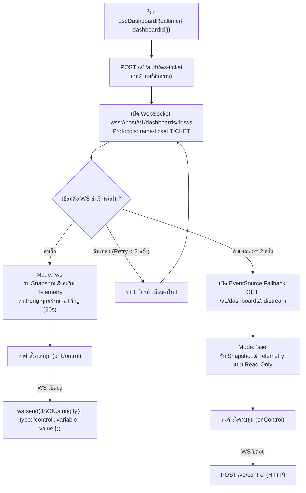

# Frontend Architecture (`apps/web`)

เอกสารนี้วิเคราะห์สถาปัตยกรรมของแอปพลิเคชันฝั่งหน้าบ้าน (`apps/web`) โดยอิงจากโค้ดจริงที่ทำงานอยู่

---

## 1. Framework & Runtime Model

### 1.1 ความเข้าใจผิดที่ต้องชี้แจง (Next.js vs React Router v7)
> **หมายเหตุสำคัญ**: ในไฟล์ `apps/web/AGENTS.md` มีข้อความเตือนเกี่ยวกับ Next.js แขวนอยู่ และใน `apps/server/src/index.ts` มีคอมเมนต์ว่า client คือ Next.js **อย่างไรก็ดี ใน Implementation จริง แอปพลิเคชันไม่ได้ใช้ Next.js แต่ทำงานบน React Router v7 อย่างสมบูรณ์**
> 
> **หลักฐานจากโค้ด**:
> - `apps/web/package.json`: ใช้ `"@react-router/node": "^8.4.0"`, `"react-router": "^8.4.0"`, `"@react-router/dev": "^8.4.0"`, `"vite": "^8.3.0"` และไม่มีแพ็กเกจ `next` อยู่ใน `dependencies` เลย
> - `apps/web/react-router.config.ts`: ประกาศ `{ ssr: true, appDirectory: "src" }`
> - `apps/web/vite.config.ts`: ใช้ `@react-router/dev/vite` และ `@tailwindcss/vite`
> - `apps/web/src/routes.ts`: กำหนดการ Routing ผ่านนิยามของ React Router v7

### 1.2 Runtime Model
- **UI Framework**: React 19.2.8
- **Framework Engine**: React Router v7 (Framework Mode)
- **SSR (Server-Side Rendering)**: เปิดใช้งาน (`ssr: true`) ทำให้ Route Loaders ทำงานบน Node.js Server ก่อนส่ง HTML เริ่มต้นไปยัง Browser
- **Styling**: Tailwind CSS v4 (`@tailwindcss/vite`) ร่วมกับตัวแปร CSS Variables ใน `apps/web/src/globals.css`
- **Component Primitives**: Radix UI (`@radix-ui/react-*`), Lucide Icons (`lucide-react`)

---

## 2. Routing & Layout Structure

การตั้งค่าเส้นทางทั้งหมดอยู่ที่ไฟล์ `apps/web/src/routes.ts`:

---

## 3. Server / Client Boundaries & BFF Pattern

### 3.1 BFF Reverse Proxy (`apps/web/src/routes/api-proxy.ts`)
- เมื่อทำงานบนเบราว์เซอร์ `API_BASE_URL` ใน `apps/web/src/lib/api-client.ts` จะเป็นค่าว่าง `""` (Same-Origin)
- Request `/v1/*` จากหน้าบ้านจะวิ่งเข้าหาเซิร์ฟเวอร์ React Router ของ `apps/web` ก่อน
- ฟังก์ชัน `forward()` ใน `apps/web/src/routes/api-proxy.ts`:
  1. ดึง Token จากคุกกี้เบราว์เซอร์ผ่าน `getBffSessionToken(headers.get("cookie"))` (`apps/web/src/lib/bff-session.server.ts`)
  2. ลบ Header `cookie` ออก และเซ็ต `x-session-token: <token>` ส่งต่อไปยัง Backend (`serverConfig.internalApiUrl`)
  3. ส่ง Body และ Method แบบ Passthrough
  4. หากเป็น endpoint `auth/sign-out` จะแนบ Header `Set-Cookie` สำหรับล้างคุกกี้กลับไปยัง Browser ผ่าน `clearSessionCookie(request)`

### 3.2 SSR Server Loaders (`apps/web/src/lib/server-loaders.ts`)
- ในแต่ละหน้าก่อน Render บนเซิร์ฟเวอร์ จะมีการเรียกใช้ Loader เช่น:
  - `loadProjectData(request, projectId)`: โหลดข้อมูล Project, Current User, Accessible Dashboards ผ่านการยิงตรงไปยัง Backend
  - ใช้คุกกี้จาก Incoming `request` เพื่อยืนยันสิทธิ์ตั้งแต่ขั้นตอน SSR ป้องกันหน้าจอกะพริบ (FOUC / Content Flash)

---

## 4. State Management Architecture

ระบบไม่ได้ใช้ Global State Manager ภายนอกขนาดใหญ่ (เช่น Redux หรือ Zustand) แต่ใช้โครงสร้าง State แบบรวมศูนย์ผ่าน React Context ร่วมกับ Local State:

1. **`ShellContext` (`apps/web/src/components/ShellContext.tsx`)**:
   - ควบคุมสถานะ App Shell ระดับบนสุด
   - เก็บข้อมูล: `currentUser`, `currentProject`, `projects` ทั้งหมด, รายการ `dashboards`, สถานะเปิด/ปิด Sidebar บน Mobile (`sidebarOpen`)
   - จ่าย Function สำหรับแจ้งเตือนการสร้าง/แก้ไข Project ให้ทุก Component ภายใน AppShellLayout
2. **URL Search Params & Routing State**:
   - หน้าจออย่าง `apps/web/src/routes/dashboards/view.tsx` ใช้ URL Params `:proj` และ `:id` เป็น Single Source of Truth
   - หน้าจอสร้าง Automation (`apps/web/src/routes/automations/editor.tsx`) รับค่า `?recipe=` หรือ `?mode=compose` ผ่าน Search Params
3. **Local Component & Hook State**:
   - แดชบอร์ดใช้ Local State เก็บค่าล่าสุดของตัวแปรและ Time-series arrays ที่ได้รับจาก Realtime Socket

---

## 5. Realtime Telemetry Hook (`useDashboardRealtime`)

ตั้งอยู่ที่ `apps/web/src/hooks/useDashboardRealtime.ts` ซึ่งทำหน้าที่เป็นหัวใจสำคัญในการเชื่อมต่อแบบ Dual Stream:

---

## 6. Dashboard Subsystem Architecture

ระบบแดชบอร์ดตั้งอยู่ที่ `apps/web/src/routes/dashboards/`:

### 6.1 Grid & Responsive Transformation
- **Desktop Grid**: ใช้ `react-grid-layout` (`apps/web/src/routes/dashboards/grid/DashboardGrid.tsx`) กำหนดความกว้าง 24 Columns
- **Mobile Layout Auto-Reflow**: ใน `apps/web/src/routes/dashboards/grid/mobile-layout.ts` ฟังก์ชัน `deriveMobileLayout()` จะคำนวณตำแหน่งวิดเจ็ตใหม่สำหรับหน้าจอโทรศัพท์อัตโนมัติ:
  - เรียงตามลำดับแถวและคอลัมน์เดิมจากเดสก์ท็อป
  - ปรับความกว้างให้เต็มจอ
  - รองรับ `quirks.mobile.paired`: สำหรับวิดเจ็ตควบคุมขนาดเล็ก (เช่น สวิตช์ 2 ตัว) สามารถจัดให้อยู่คู่กันในแถวเดียวบนมือถือได้

### 6.2 Central Widget Registry (`widgets/registry.ts`)
- ทะเบียนวิดเจ็ตถูกนิยามแบบ Type-safe:
  - `IotValue` (`iot-value`): แสดงค่าตัวเลข/ข้อความเดี่ยว
  - `IotGauge` (`iot-gauge`): แสดงเกจวัดระดับแบบเข็ม/ครึ่งวงกลม
  - `IotChart` (`iot-chart`): แสดงกราฟเส้น / กราฟพื้นที่ (Area) ย้อนหลังโดยใช้ Recharts
  - `IotToggle` (`iot-toggle`): สวิตช์เปิด/ปิดสำหรับควบคุม Relay
  - `IotPush` (`iot-push`): ปุ่มกดแบบ Momentary หรือ Trigger
  - `IotSlider` (`iot-slider`): สไลเดอร์ปรับค่าแบบต่อเนื่อง (0-100, หรี่ไฟ, ปรับรอบพัดลม)
  - `IotColor` (`iot-color`): ตัวเลือกสี RGB (Hex, RGB565) สำหรับไฟ LED/NeoPixel
  - `IotPercent` (`iot-percent`): แถบแสดงเปอร์เซ็นต์
- **Dispatcher (`WidgetDispatcher.tsx`)**: อ่านชนิดวิดเจ็ตจาก Layout JSON แล้วแมปไปยัง Component ที่ตรงกัน พร้อมส่งค่า `value`, `seriesMap`, และ Callback `onControl(variable, value)`

---

## 7. Automation Canvas Architecture

ระบบสร้าง Automation ตั้งอยู่ที่ `apps/web/src/routes/automations/`:
- **Canvas Rendering**: ใช้ `@xyflow/react` ใน `AutomationEditor.tsx` รองรับการลากเชื่อมต่อ Node และ Edge
- **Node Representation (`BlockNode.tsx`)**: แสดงการ์ดของแต่ละ Block มี Port เชื่อมต่อชัดเจน (สีและไอคอนตามหมวดหมู่ Trigger / Condition / Action)
- **Edge Routing (`WorkflowEdge.tsx`)**: เส้นเชื่อมแบบ Smooth Step แสดงป้ายกำกับของ Port เช่น `true` (สีเขียว), `false` (สีส้ม)
- **Natural Language Draft (`ComposePanel.tsx`)**:
  - ผู้ใช้สามารถพิมพ์ข้อความเป็นประโยค (เช่น *"เมื่ออุณหภูมิเกิน 30 ให้เปิดพัดลมและส่ง Telegram"*)
  - ส่งไปวิเคราะห์ผ่าน Server Endpoint `POST /admin/projects/:proj/automations/draft`
  - นำผลลัพธ์ที่เป็น Graph Draft มาแสดงบน Canvas ทันที พร้อมแท็บ Review Items ให้ผู้ใช้ตรวจสอบก่อนกดบันทึก
