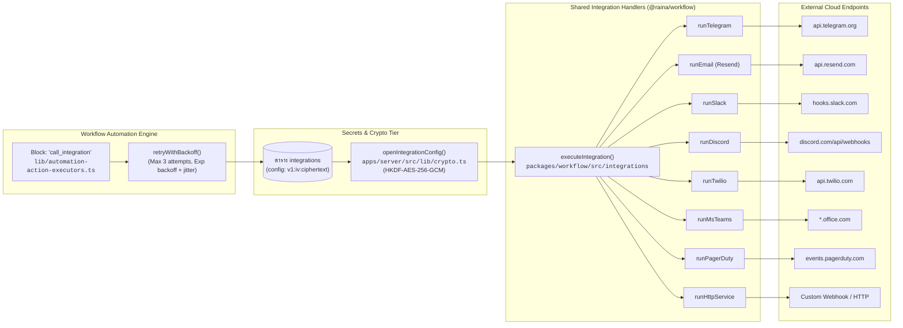

# Integrations Subsystem

เอกสารนี้วิเคราะห์ระบบเชื่อมต่อภายนอก (Integrations Subsystem) ของ Raina ครอบคลุมทั้ง 8 ชนิดที่รองรับ การเข้ารหัสลับข้อมูลความลับ (Secrets Encryption) และกระบวนการเรียกใช้งานจาก Automation Engine

---

## 1. Overview & Architecture



---

## 2. Shared Integration Abstraction

การเชื่อมต่อภายนอกทั้งหมดถูกนิยามเป็น Catalog กลางในแพ็กเกจ `@raina/workflow` เพื่อให้หน้าบ้าน (`apps/web`) สามารถสร้าง Form UI ได้อย่างอัตโนมัติ และหลังบ้าน (`apps/server`) สามารถเรียกใช้งานได้อย่างเป็นมาตรฐานเดียวกัน:

- **Specification Type (`ConnSpec`)**: นิยามใน `packages/workflow/src/integrations/types.ts`
- **Catalog Registry (`CATALOG`)**: รวบรวมใน `packages/workflow/src/integrations/specs.ts`
- **Execution Handlers**: ทำงานใน `packages/workflow/src/integrations/handlers.ts` ผ่านฟังก์ชันตัวกลาง `doFetch()` ซึ่งควบคุม Timeout ไม่เกิน 15 วินาที

---

## 3. รายการ Integrations ทั้ง 8 ชนิดที่รองรับจริง

### 3.1 HTTP Service (`http_service`)
- **ไฟล์ Implementation**: `packages/workflow/src/integrations/handlers.ts` — `runHttpService`
- **Method ที่รองรับ**: `POST`, `GET`, `PUT`, `PATCH`, `DELETE`
- **Body & Template**: รองรับการใส่ Template สำหรับ Interpolate ตัวแปร (เช่น `{{variable}}`, `{{value}}`, `{{event}}`)
- **HMAC Signature**: หากระบุ `secret` ระบบจะคำนวณ Signature ด้วย **HMAC-SHA256** เหนือ Request Body แล้วแนบไปใน Header `X-Raina-Signature` เพื่อให้ปลายทางตรวจสอบความถูกต้องได้

### 3.2 Email via Resend (`email`)
- **ไฟล์ Implementation**: `packages/workflow/src/integrations/handlers.ts` — `runEmail`
- **Endpoint ภายนอก**: `https://api.resend.com/emails`
- **คอนฟิกสำคัญ**:
  - `api_key`: Resend API Key (`re_...`)
  - `from`: ที่อยู่อีเมลผู้ส่งที่ Verify กับ Resend แล้ว
  - `to`: อีเมลปลายทาง (รองรับหลายที่อยู่คั่นด้วยจุลภาค `,`)
  - `subject` และ `body`: รองรับ String Interpolation

### 3.3 Telegram Bot (`telegram`)
- **ไฟล์ Implementation**: `packages/workflow/src/integrations/handlers.ts` — `runTelegram`
- **Endpoint ภายนอก**: `https://api.telegram.org/bot<bot_token>/sendMessage`
- **คอนฟิกสำคัญ**:
  - `bot_token`: โทเค็นบอทจาก @BotFather
  - `chat_id`: ตัวเลข Chat ID หรือ @channelname
  - `message`: ข้อความที่ต้องการส่ง

### 3.4 Slack Incoming Webhook (`slack`)
- **ไฟล์ Implementation**: `packages/workflow/src/integrations/handlers.ts` — `runSlack`
- **คอนฟิกสำคัญ**: `webhook_url` (Incoming webhook URL จาก Slack App) และ `message`

### 3.5 Discord Webhook (`discord`)
- **ไฟล์ Implementation**: `packages/workflow/src/integrations/handlers.ts` — `runDiscord`
- **Operations ที่รองรับ**:
  1. `send_message`: ส่งข้อความข้อความล้วน (`content`)
  2. `send_embed`: ส่ง Embed Card สีเขียวธีม Raina (`color: 0x10b981`) พร้อม `title` และ `description`

### 3.6 Twilio SMS & WhatsApp (`twilio`)
- **ไฟล์ Implementation**: `packages/workflow/src/integrations/handlers.ts` — `runTwilio`
- **Endpoint ภายนอก**: `https://api.twilio.com/2010-04-01/Accounts/<account_sid>/Messages.json`
- **Operations ที่รองรับ**:
  1. `send_sms`: ส่ง SMS ผ่านหมายเลข `sms_from`
  2. `send_whatsapp`: ส่ง WhatsApp message ผ่านหมายเลข `whatsapp_from` (ระบบจะเติม prefix `whatsapp:` ให้อัตโนมัติหากยังไม่มี)

### 3.7 Microsoft Teams (`ms_teams`)
- **ไฟล์ Implementation**: `packages/workflow/src/integrations/handlers.ts` — `runMsTeams`
- **รูปแบบ Payload**: ส่งในมาตรฐาน Office 365 Connector `MessageCard` JSON (`@type: "MessageCard"`)

### 3.8 PagerDuty (`pagerduty`)
- **ไฟล์ Implementation**: `packages/workflow/src/integrations/handlers.ts` — `runPagerDuty`
- **Endpoint ภายนอก**: `https://events.pagerduty.com/v2/enqueue` (Events API v2)
- **คอนฟิกสำคัญ**:
  - `routing_key`: Integration 32-character key
  - `severity`: เลือกระดับได้ (`critical`, `error`, `warning`, `info`)
  - `dedup_key`: สำหรับจัดกลุ่ม Alert ไม่ให้เกิดการแจ้งเตือนซ้ำซ้อน

---

## 4. Security & Cryptographic Sealing

การเก็บรักษา Secrets ทั้งหมด (Tokens, Passwords, Webhook URLs) มีสถาปัตยกรรมความปลอดภัยดังนี้:

1. **At-Rest Envelope Encryption (`apps/server/src/lib/crypto.ts`)**:
   - เข้ารหัสด้วย **AES-256-GCM**
   - ดึงคีย์ผ่าน **HKDF-SHA-256** โดยใช้ Master Key (`ENCRYPTION_KEY` หรือ `JWT_SECRET`) ร่วมกับ Salt `raina-encrypt-salt` และ Info string `raina/encrypt/integration-config`
   - จัดเก็บในฟิลด์ `Integration.config` ในฟอร์แมต:
     ```
     v1:<base64_iv_12bytes>:<base64_ciphertext>
     ```
2. **UI Masking (`maskConfig`)**:
   - เมื่อหน้าบ้านเรียก `GET /v1/admin/projects/:proj/integrations` ระบบจะถอดรหัสในหน่วยความจำชั่วคราว แล้วทำ Masking ฟิลด์ที่เป็นความลับด้วยฟังก์ชัน `maskConfig()`:
     ```json
     {
       "bot_token": "••••a1b2",
       "webhook_url": "••••/services/xyz"
     }
     ```
   - คอนฟิกดิบจะไม่รั่วไหลไปยัง Browser เด็ดขาด
3. **Safe Merge Update**:
   - ใน `apps/server/src/modules/integrations/integrations.routes.ts` (`updateIntegrationHandler`) มีการป้องกันกรณีที่ผู้ใช้แก้ไขเฉพาะชื่อ Integration โดยส่งค่าคอนฟิกที่ถูก Mask (`••••...`) กลับมา ระบบจะตรวจสอบและคงค่า Secret จริงเดิมไว้ ไม่เขียนทับด้วย Mask String

---

## 5. Execution Retries & Testing

1. **Automatic Retries (`retryWithBackoff`)**:
   - เมื่อ Action ชนิด `call_integration` ถูกเรียกใน Workflow ระบบจะห่อหุ้มด้วย `retryWithBackoff` ใน `apps/server/src/lib/engine.ts`
   - พยายามรันสูงสุด **3 ครั้ง** โดยเว้นระยะแบบ Exponential Backoff (เริ่มต้น 150ms, Factor 2, สูงสุด 2000ms) พร้อมสุ่ม Jitter เพื่อป้องกัน Thundering Herd
2. **Status Audit & Logging**:
   - บันทึกผลลัพธ์รอบล่าสุดลงฟิลด์ `lastRunAt`, `lastRunStatus` (`ok` หรือ `error`), และ `lastError` ในตาราง `integrations`
   - บันทึกประวัติการกระทำลงในตาราง `audit_log` ผ่านฟังก์ชัน `recordAudit()`
3. **Interactive Testing**:
   - ผู้ดูแลระบบสามารถกดปุ่ม "Test Integration" จากหน้าบ้าน ซึ่งจะยิงไปที่ `POST /v1/admin/projects/:proj/integrations/:id/test` เพื่อทดสอบยิงข้อมูลตัวอย่างจริงได้ทันทีโดยไม่ต้องรอให้อุปกรณ์ IoT ส่งค่า
