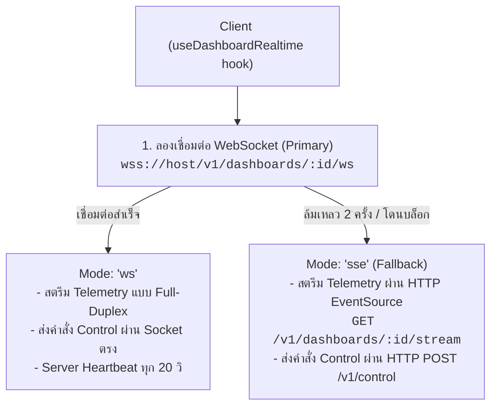
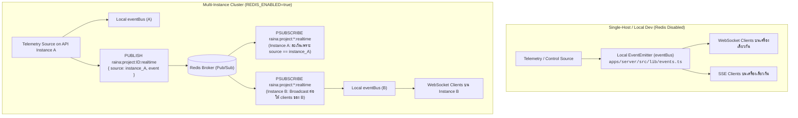

# Realtime Architecture & Dual-Stream Delivery

เอกสารนี้อธิบายสถาปัตยกรรมระบบ Realtime ของ Raina ซึ่งทำหน้าที่สตรีมข้อมูล Telemetry สถานะอุปกรณ์ และรับคำสั่งควบคุมแบบความหน่วงต่ำมาก (Sub-millisecond latency)

---

## 1. Dual-Transport Model (WebSocket + SSE Fallback)

Raina ถูกออกแบบมาให้สามารถแสดงผลบนเครือข่ายทุกประเภท ไม่ว่าจะเป็นเน็ตบ้าน ออฟฟิศ หรือเน็ตมือถือที่มีไฟร์วอลล์บล็อกการเชื่อมต่อแบบ Two-way Socket โดยใช้โมเดลคู่ขนาน:



---

## 2. In-Memory EventBus vs. Distributed Redis Pub/Sub

สถาปัตยกรรมกระจายอีเวนต์ใน `apps/server/src/lib/events.ts` รองรับการปรับเปลี่ยนตามขนาดการติดตั้ง (Elastic Topology):



### รายละเอียดการทำงานของ Realtime Bus (`apps/server/src/lib/events.ts`)
- **Echo Suppression**: เมื่อ Publish อีเวนต์ ระบบจะห่อเป็น Envelope `{ source: instanceId, event }` ซึ่ง `instanceId` เป็น UUID ที่สุ่มขึ้นตอนเริ่มโพรเซส ทำให้เมื่อ Instance ตนเองรับ Message กลับมาจาก Redis ระบบจะตรวจพบว่ามาจากตนเองและไม่ยิงซ้ำ (Prevent Infinite Echo Loop)
- **Topic Naming**:
  - Redis Channel รายโปรเจกต์: `raina:project:<projectId>:realtime`
  - Pattern Subscription: `raina:project:*:realtime`
  - In-process Event Topic: `project:<projectId>`
- **Max Listeners**: ตั้งค่า `eventBus.setMaxListeners(500)` เพื่อรองรับการเปิดหลายแดชบอร์ดพร้อมกัน

---

## 3. Realtime Event Specifications

ทุกอีเวนต์ที่วิ่งอยู่ใน Realtime Stream มีรูปแบบโครงสร้างที่แน่นอน (`apps/server/src/lib/events.ts`):

### 3.1 `telemetry` (ข้อมูลเซนเซอร์ล่าสุด)
```json
{
  "type": "telemetry",
  "projectId": "proj_123",
  "deviceId": "dev_456",
  "variable": "temperature",
  "value": 28.5,
  "timestamp": 1774396800000
}
```

### 3.2 `control` (คำสั่งควบคุมหรือการเปลี่ยนสถานะจากหน้าบ้าน)
```json
{
  "type": "control",
  "projectId": "proj_123",
  "deviceId": "dev_456",
  "variable": "pump_relay",
  "value": true,
  "timestamp": 1774396800000
}
```

### 3.3 `device_status` (สถานะการเชื่อมต่อของฮาร์ดแวร์)
```json
{
  "type": "device_status",
  "projectId": "proj_123",
  "deviceId": "dev_456",
  "status": "online", // หรือ "offline"
  "timestamp": 1774396800000
}
```

### 3.4 `automation_event` (อีเวนต์ภายในที่ถูกปล่อยโดย Workflow Action)
```json
{
  "type": "automation_event",
  "projectId": "proj_123",
  "event": "greenhouse_overheat",
  "context": { "temperature": 38.2 },
  "timestamp": 1774396800000
}
```

---

## 4. Connection Lifecycle & Snapshot Initialization

เมื่อไคลเอนต์เปิดหน้าแดชบอร์ด (`apps/server/src/modules/dashboards/dashboards.ws.ts` และ `dashboards.routes.ts`):

1. **Authentication Check**: ตรวจสอบว่าแดชบอร์ดเป็น `public` หรือไม่ หากเป็น Private ต้องยืนยันตัวตนผ่าน Session หรือ WebSocket Ticket
2. **Layout Variable Extraction**: เซิร์ฟเวอร์อ่าน Layout JSON ของแดชบอร์ด เพื่อหาว่าแดชบอร์ดนี้มีวิดเจ็ตที่ผูกกับตัวแปรใดบ้าง (`targetKeys`) เพื่อที่จะ **ไม่ส่งข้อมูลตัวแปรที่ไม่เกี่ยวข้องให้แดชบอร์ดนี้** (Variable-level Isolation)
3. **Initial Snapshot Payload**:
   เซิร์ฟเวอร์จะส่งก้อนข้อมูลเริ่มต้นทันทีที่เปิดการเชื่อมต่อ:
   ```json
   {
     "type": "snapshot",
     "projectId": "proj_123",
     "variables": {
       "temperature": 28.5,
       "humidity": 65.0,
       "pump_relay": false
     },
     "series": {
       "temperature": { "t": [1774396700000, 1774396760000], "v": [28.1, 28.5] }
     },
     "timestamp": 1774396800000
   }
   ```
4. **Heartbeat Maintenance**:
   - WebSocket: เซิร์ฟเวอร์ส่ง `{ "type": "ping" }` ทุก 20 วินาที ไคลเอนต์ตอบกลับ `{ "type": "pong" }`
   - SSE: เซิร์ฟเวอร์ส่งคอมเมนต์บรรทัด `: ping\n\n` ทุก 15 วินาที เพื่อไม่ให้ Reverse Proxy หรือ Gateway ตัดการเชื่อมต่อเนื่องจาก Idle Timeout

---

## 5. RLP Binary Transport Backpressure & Slow Peer Handling

ในระดับโพรโทคอลฮาร์ดแวร์ RLP (`packages/rlp/src/index.ts` — `RlpConnection`):
- **Socket Buffer Protection**: หากการเขียน Socket ฝั่ง TCP คืนค่า `false` ระบบจะเข้าสู่โหมด `draining = true` และปล่อยอีเวนต์ `backpressure`
- **Bounded In-Memory Queue**: ข้อความที่จะส่งไปยังอุปกรณ์จะถูกพักไว้ในคิว `queued: Buffer[]` โดยจำกัดขนาดสูงสุดที่ `maxQueuedBytes` (ค่าเริ่มต้น 128 KB)
- **Slow Peer Drop**: หากไมโครคอนโทรลเลอร์รับข้อมูลช้าจนบัฟเฟอร์เกิน 128 KB ระบบจะปล่อยอีเวนต์ `slowPeer`, ส่งแพ็กเก็ต Error `ErrorCode.SLOW_PEER (9)` และตัดการเชื่อมต่อทันที เพื่อป้องกันหน่วยความจำของเซิร์ฟเวอร์รั่วไหลหรือหมด
