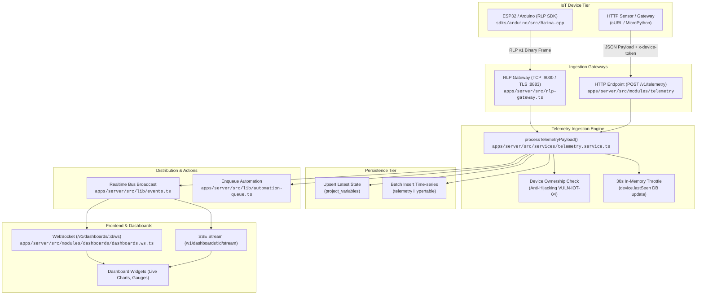
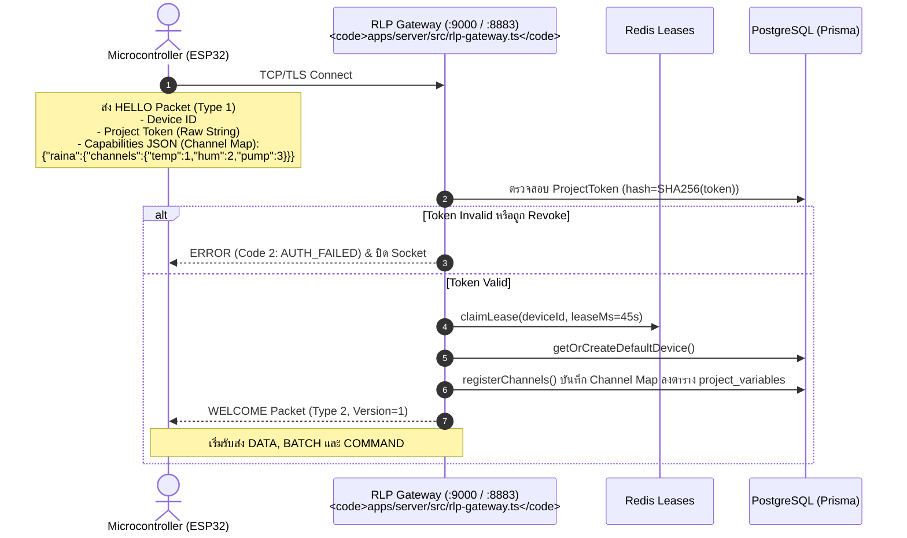
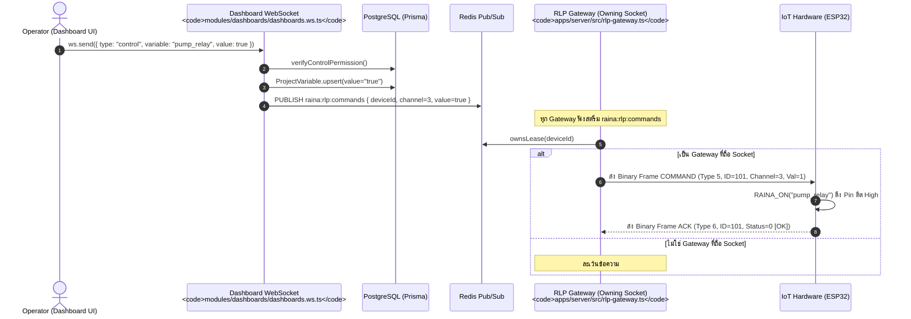

# Telemetry & IoT Architecture

เอกสารนี้อธิบายสถาปัตยกรรมระบบรับส่งข้อมูลเซนเซอร์ (Telemetry Ingestion) และการสั่งการอุปกรณ์ฮาร์ดแวร์ (Downlink Control) แบบ End-to-End ตั้งแต่ไมโครคอนโทรลเลอร์จนถึงหน้าจอแดชบอร์ด

---

## 1. End-to-End Telemetry Data Flow

---

## 2. Ingestion Protocols

Raina รองรับช่องทางการนำเข้าข้อมูล 2 ช่องทาง:

### 2.1 Raina Link Protocol (RLP v1) — Binary Transport
- **พอร์ต**: `9000` (TCP ไบนารีสำหรับ Development), `8883` (TLS ไบนารีสำหรับ Production)
- **โพรเซส**: `apps/server/src/rlp-gateway.ts` ขับเคลื่อนโดยแพ็กเกจ `@raina/rlp`
- **โครงสร้างเฟรม (Frame Structure)**:
  - ส่วนหัวคงที่ 4 ไบต์:
    - Byte 0: `PacketType` (1 ไบต์)
    - Byte 1: `FrameFlag` (1 ไบต์, เช่น `HAS_TIMESTAMP = 0x01`)
    - Bytes 2-3: `PayloadLength` (2 ไบต์ Unsigned 16-bit Big-Endian, ขนาดสูงสุด 64 KB)
  - ข้อมูล Payload (0 - 65,535 ไบต์)
- **ชนิดของ Packet (`PacketType`)**:
  - `HELLO (1)`: อุปกรณ์ส่งเพื่อเริ่ม Handshake ยืนยันตัวตน
  - `WELCOME (2)`: เซิร์ฟเวอร์ตอบรับเมื่อผ่านการตรวจสอบ
  - `DATA (3)`: อุปกรณ์ส่งค่าตัวแปรเดี่ยว (Single Metric)
  - `BATCH (4)`: อุปกรณ์ส่งค่าตัวแปรหลายตัวพร้อมกัน (Multi-metrics Batch)
  - `COMMAND (5)`: เซิร์ฟเวอร์สั่งการไปยังอุปกรณ์ (Downlink Control)
  - `ACK (6)`: อุปกรณ์ตอบรับสถานะคำสั่ง (0 = OK, 1 = Rejected, 2 = Unsupported, 3 = Failed)
  - `PING (7)` / `PONG (8)`: ตรวจสอบความพร้อมของการเชื่อมต่อ (Heartbeat) พร้อม Nonce 4 ไบต์
  - `ERROR (9)` / `DISCONNECT (10)`: แจ้งรหัสข้อผิดพลาดและปิดการเชื่อมต่อ

### 2.2 HTTP REST Ingestion
- **พอร์ต**: `3001` (หรือผ่าน Reverse Proxy พอร์ต 80/443)
- **Endpoint**: `POST /v1/telemetry`
- **Header**: `x-device-token: YOUR_HARDWARE_TOKEN` (หรือ Bearer token)
- **จำกัดขนาด**: ไม่เกิน 64 KB (`bodyLimit`)

---

## 3. RLP Handshake & Dynamic Channel Multiplexing

ในระบบ RLP อุปกรณ์จะไม่ส่งชื่อตัวแปรที่เป็นข้อความยาว (เช่น `"temperature"`) ในทุกแพ็กเก็ต เพื่อประหยัด Bandwidth ของไมโครคอนโทรลเลอร์ แต่จะใช้ **Numeric Channel (uint16)** แทน:

---

## 4. Telemetry Processing & Validation Pipeline

ฟังก์ชัน `processTelemetryPayload()` ใน `apps/server/src/services/telemetry.service.ts` ทำหน้าที่ประมวลผลข้อมูลกลางสำหรับทุก Protocol:

1. **Anti-Hijacking Protection (VULN-IOT-04)**:
   - ตรวจสอบ `getOrCreateDefaultDevice(projectId, deviceId, tokenId)`
   - หากอุปกรณ์เคยลงทะเบียนไว้กับ Token หนึ่งแล้ว แล้วมี Token อื่นอ้างชื่ออุปกรณ์นี้ ระบบจะปฏิเสธด้วยข้อผิดพลาด:
     `"Device ownership conflict: Device is registered to another hardware token"`
2. **Timestamp Sanitization (`sanitizeTimestamp`)**:
   - ป้องกันข้อมูลย้อนเวลาหรือล่วงหน้าเกินจริง
   - ตรวจสอบให้อยู่ในหน้าต่างเวลา: `[-24 ชั่วโมง, +10 นาที]` จากเวลาปัจจุบันของเซิร์ฟเวอร์
   - หากอยู่นอกช่วงเวลา จะแทนที่ด้วยเวลาปัจจุบันของเซิร์ฟเวอร์ทันที
3. **Key & Value Sanitization**:
   - ตรวจสอบชื่อตัวแปรด้วย Regex `/^[a-zA-Z0-9_.-]{1,64}$/`
   - จำกัดความยาวของค่าตัวแปรไม่เกิน 512 ไบต์
   - จำกัดตัวแปรไม่เกิน 50 คีย์ต่อหนึ่ง Payload
4. **Throttled LastSeen Update**:
   - เพื่อลดปัญหา Database Write Contention ในระบบที่มีอุปกรณ์ส่งข้อมูลความถี่สูง (เช่น ทุก 100ms) ระบบจะจำกัดการอัปเดตฟิลด์ `device.lastSeen` ในฐานข้อมูลให้เกิดขึ้น **ไม่เกิน 1 ครั้งในรอบ 30 วินาทีต่ออุปกรณ์** ผ่าน In-memory Map `deviceLastSeenDbMap`
5. **Realtime Broadcast**:
   - ส่งอีเวนต์ `device_status` (online) และ `telemetry` ไปยัง EventBus ทันทีโดยมีความหน่วงระดับ 0ms (Sub-millisecond)
6. **Persistence**:
   - `ProjectVariable.upsert`: บันทึกค่าล่าสุด (String/Scalar)
   - `Telemetry.createMany`: บันทึกค่าตัวเลขลงตาราง TimescaleDB
7. **Automation Trigger**:
   - ส่งงานเข้า Automation Queue เพื่อประเมินเงื่อนไขอัตโนมัติ

---

## 5. Downlink Control Architecture (ส่งคำสั่งไปหาอุปกรณ์)

