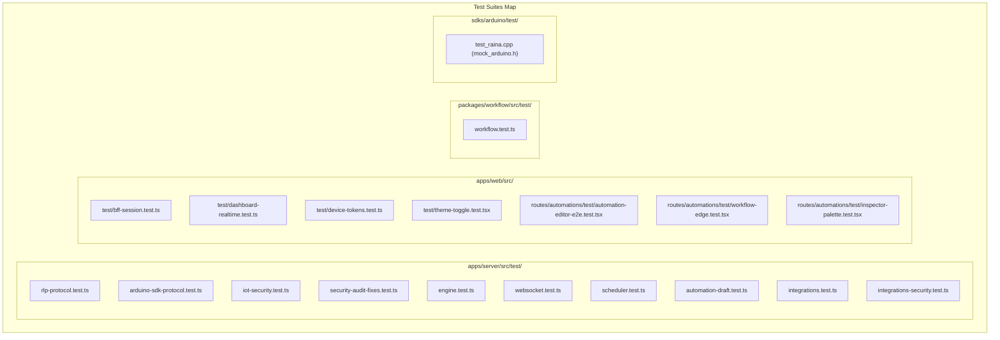

# Testing Architecture & Verification

เอกสารนี้วิเคราะห์โครงสร้างการทดสอบ (Testing Frameworks, Test Suites, Mocks และ Coverage) ทั่วทั้ง Codebase ของ Raina

---

## 1. Testing Frameworks & Tooling

| ส่วนของระบบ | Test Runner & Framework | สภาพแวดล้อม (Environment) |
| :--- | :--- | :--- |
| **`packages/workflow`** | Vitest 2.1.8 | Node.js |
| **`apps/server`** | Vitest 5.0.0 | Node.js |
| **`apps/web`** | Vitest 5.0.0, `@testing-library/react`, `@testing-library/user-event` | jsdom (`vitest.setup.ts`) |
| **`sdks/arduino`** | Clang++ 17 (`-DNATIVE_TEST`) + Custom Assertion Runner | Native Host C++ (Linux / macOS) |

---

## 2. Test Suites Organization



---

## 3. Important Coverage Areas

### 3.1 IoT & Protocol Security (`apps/server/src/test/iot-security.test.ts` & `security-audit-fixes.test.ts`)
- **Device Ownership Conflict Check (VULN-IOT-04)**: ทดสอบว่าหากอุปกรณ์ชื่อ `device_1` ถูกสร้างด้วย Token A ไปแล้ว การส่ง Telemetry ภายใต้ชื่อเดียวกันโดย Token B จะต้องถูกปฏิเสธด้วยสถานะ 403 Forbidden
- **Timestamp Window Check**: ยืนยันว่า Timestamp ที่ล่วงหน้าเกิน 10 นาที หรือย้อนหลังเกิน 24 ชั่วโมง จะถูกแทนที่ด้วยเวลาปัจจุบันของ Server
- **Anti-Replay Verification**: ทดสอบว่าคำสั่ง Downlink Control มีการตรวจสอบความสดใหม่และไม่เกิด Replay Loop
- **Constant-Time Verification**: ทดสอบว่าการเข้าสู่ระบบด้วย Username ที่ไม่มีใน DB มีระยะเวลาใกล้เคียงกับการเข้าสู่ระบบด้วยรหัสผ่านผิด ป้องกัน Timing Attacks

### 3.2 RLP v1 Binary Encoding & Framing (`apps/server/src/test/rlp-protocol.test.ts`)
- ทดสอบการ Pack/Unpack ไบนารีเฟรม 4-byte header
- ทดสอบ Data types ทุกชนิด: `BOOL`, `INT8-INT64`, `UINT8-UINT64`, `FLOAT32`, `FLOAT64`, `STRING`, `BYTES`
- ทดสอบ Backpressure และ Disconnect เมื่อไคลเอนต์เป็น Slow Peer

### 3.3 Durable Workflow Engine (`apps/server/src/test/engine.test.ts`)
- ทดสอบ Checkpoint ในตาราง `AutomationStepRun`
- ทดสอบ Idempotent Replay เมื่อ Resume งานเดิม
- ทดสอบ Exponential Backoff + Jitter ใน `retryWithBackoff`

### 3.4 Arduino C++ Native Testing (`sdks/arduino/test/test_raina.cpp`)
- จำลองสภาพแวดล้อม Arduino ด้วย `sdks/arduino/test/mock_arduino.h`
- จำลอง `Client` socket ใน C++ ตรวจสอบว่า `Raina.send()` เข้ารหัส RLP Frame ถูกต้องตามมาตรฐาน และฟังก์ชัน `RAINA_ON` ตอบสนองต่อ Incoming Command ไบนารีได้จริง

---

## 4. How to Run Tests

### รันการทดสอบทั้งหมดของ Application
```bash
pnpm test
```
*(คำสั่งนี้จะรัน vitest ใน `@raina/workflow`, `@raina/server`, และ `@raina/web`)*

### รันการทดสอบของ Arduino C++ SDK
```bash
pnpm test:arduino
```
*(คำสั่งนี้จะคอมไพล์โค้ด C++ ด้วย `clang++ -std=c++17 -DNATIVE_TEST` และรัน Unit Test ไบนารีในระดับ Native Host)*

---

## 5. Areas with Lower Test Coverage (จุดที่ควรเสริมการทดสอบ)

1. **Multi-Instance Redis Failover**: การทดสอบส่วนใหญ่จำลอง Redis Client ผ่าน In-memory Mock ยังไม่มี End-to-end Integration Test ที่ทดสอบสถานการณ์ Redis ดับกลางคันแล้วระบบ Fallback สลับกลับมาเป็น In-process
2. **Real TimescaleDB Hypertables**: Unit Tests ทดสอบผ่าน SQLite หรือ Prisma Mock โดยข้ามส่วนของ Timescale Raw SQL Queries (`by_range`, `add_retention_policy`, `raina_telemetry_now`) ซึ่งต้องอาศัย Docker PostgreSQL จริงในการรัน
