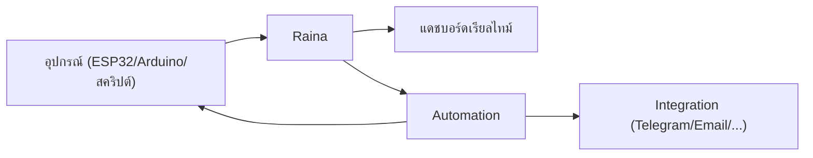

# คู่มือการใช้งาน Raina สำหรับสร้างระบบ IoT

Raina เป็นแพลตฟอร์ม IoT แบบ self-hosted ที่สร้างขึ้นมาเพื่อให้คุณรับส่งข้อมูลจากอุปกรณ์ แสดงผลบน Dashboard ได้แบบเรียลไทม์ และผูกเงื่อนไขสั่งงานอัตโนมัติได้ทันทีโดยไม่ต้องพึ่งพิงคลาวด์ภายนอก

เนื้อหาในคู่มือชุดนี้เขียนขึ้นสำหรับคนที่ต้องนำระบบไปใช้งานจริง ไม่ว่าคุณจะเป็นนักพัฒนาที่กำลังมองหาระบบกลางสำหรับโปรเจกต์ IoT วิศวกรเฟิร์มแวร์ที่ดูแลฮาร์ดแวร์ ทีมงานผู้วางระบบ หรือผู้ดูแลระบบที่ต้องติดตั้งและส่งมอบงานให้ลูกค้า

> ข้อมูลทางเทคนิคทั้งหมดอ้างอิงจากเอกสารสถาปัตยกรรมระบบในโฟลเดอร์ [`docs/`](../README.md) โดยเฉพาะในส่วน [ARCHITECTURE](../ARCHITECTURE.md), [TELEMETRY](../TELEMETRY.md), [AUTOMATION](../AUTOMATION.md), [INTEGRATIONS](../INTEGRATIONS.md), [API](../API.md) และ [DEPLOYMENT](../DEPLOYMENT.md) ทุกขั้นตอนและพฤติกรรมของระบบในคู่มือนี้ตรงตามการทำงานจริงของ Raina

## วงจรการไหลของข้อมูล

การทำงานของระบบเริ่มต้นเมื่ออุปกรณ์ส่งข้อมูลตัวแปรเข้ามายัง Raina เซิร์ฟเวอร์จะบันทึกสถานะปัจจุบันเก็บไว้พร้อมกับบันทึกประวัติย้อนหลังลงฐานข้อมูลแบบ Time-Series จากนั้นระบบจะกระจายข้อมูลไปยังหน้า Dashboard ที่เปิดอยู่ทันที ขณะเดียวกัน เวิร์กโฟลว์ของ Automation ก็จะนำค่านั้นไปประเมินเงื่อนไข ถ้าเข้าเกณฑ์ที่กำหนดไว้ ระบบก็พร้อมจะส่งคำสั่งควบคุมกลับไปยังอุปกรณ์ หรือยิงแจ้งเตือนออกไปยังช่องทางภายนอกตามที่คุณตั้งค่าไว้

## สารบัญคู่มือ

| เอกสาร | เนื้อหา |
| :--- | :--- |
| [Getting started](./getting-started.md) | เริ่มต้นจากศูนย์จนเห็นอุปกรณ์ตัวแรกทำงานและส่งข้อมูลได้จริง |
| [Concepts](./concepts.md) | ทำความเข้าใจโมเดลและคำศัพท์หลักของ Raina เช่น Project, Device, Variable, Token, Dashboard, Automation และ Integration |
| [Projects และสิทธิ์ผู้ใช้](./projects-and-access.md) | การจัดการโปรเจกต์ เชิญสมาชิก และกำหนดสิทธิ์การเข้าถึง Dashboard รวมถึงการควบคุมอุปกรณ์ |
| [Devices และ hardware token](./devices-and-tokens.md) | กลไกการลงทะเบียนอุปกรณ์อัตโนมัติ การสร้างและเพิกถอน Token |
| [ส่งข้อมูล telemetry](./telemetry.md) | ส่งข้อมูลผ่าน HTTP พร้อมข้อกำหนดเรื่องชื่อตัวแปร ข้อจำกัด และ Timestamp |
| [RLP และเฟิร์มแวร์](./rlp-and-firmware.md) | เชื่อมต่อผ่าน Raina Link Protocol (RLP v1), ใช้งาน Arduino SDK และตัวจำลองอุปกรณ์ |
| [Dashboards](./dashboards.md) | ออกแบบ Dashboard จัดวาง Widget และสร้างลิงก์สำหรับแชร์ |
| [Automations](./automations.md) | สร้างเวิร์กโฟลว์ด้วยบล็อก Trigger, Condition และ Action พร้อมวิธีทดสอบและดูประวัติ Run |
| [Integrations](./integrations.md) | เชื่อมต่อระบบภายนอก 8 ช่องทาง (Telegram, Email, Slack, Discord, Twilio, Teams, PagerDuty, HTTP) |
| [Deploy และดูแลระบบ](./operations.md) | ติดตั้งด้วย Docker, ตั้งค่า HTTPS, แบ็กอัปข้อมูล และอัปเดตระบบ |
| [Tutorial: ระบบมอนิเตอร์เซ็นเซอร์](./tutorials.md) | ทำตามทีละก้าวตั้งแต่จำลองอุปกรณ์ แสดงผลบน Dashboard ไปจนถึงแจ้งเตือนอัตโนมัติ |
| [Troubleshooting](./troubleshooting.md) | รวมวิธีตรวจสอบและแก้ไขปัญหาที่พบบ่อย |

## แนวทางการเลือกอ่านตามสายงาน

คุณสามารถเลือกอ่านเอกสารตามลักษณะงานที่กำลังทำอยู่เพื่อเริ่มใช้งานได้เร็วขึ้น

ถ้าต้องการเห็นระบบทำงานให้เร็วที่สุด เริ่มจาก [Getting started](./getting-started.md) แล้วลองทำตาม [Tutorial](./tutorials.md) ที่ใช้ตัวจำลองอุปกรณ์ คุณจะเห็นภาพรวมการทำงานทั้งหมดโดยยังไม่ต้องแตะฮาร์ดแวร์จริง

ถ้าคุณทำงานฝั่งเฟิร์มแวร์หรือดูแลอุปกรณ์ เริ่มจาก [Concepts](./concepts.md) เพื่อทำความเข้าใจโครงสร้างข้อมูล จากนั้นอ่านเรื่อง [Devices และ hardware token](./devices-and-tokens.md) เพื่อรู้วิธีออกรหัสให้อุปกรณ์ แล้วเลือกช่องทางสื่อสารที่เหมาะกับคุณระหว่าง [RLP และเฟิร์มแวร์](./rlp-and-firmware.md) สำหรับคอนเนกชันแบบเปิดค้าง หรือ [ส่งข้อมูล telemetry](./telemetry.md) สำหรับการส่งแบบรอบเวลาผ่าน HTTP

ถ้าเน้นการออกแบบหน้าจอและส่งมอบงานให้ผู้ใช้ ให้ศึกษา [Dashboards](./dashboards.md) ควบคู่กับ [Projects และสิทธิ์ผู้ใช้](./projects-and-access.md) ซึ่งจะครอบคลุมทั้งการจัดวาง Widget และการจำกัดสิทธิ์สั่งงานของลูกค้า

ถ้าคุณต้องการทำระบบอัตโนมัติ อ่าน [Automations](./automations.md) แล้วไปต่อที่ [Integrations](./integrations.md) เพื่อดูวิธีผูกเวิร์กโฟลว์เข้ากับช่องทางแจ้งเตือนอย่าง Telegram หรืออีเมล

ส่วนทีมโครงสร้างพื้นฐานหรือผู้ดูแลเซิร์ฟเวอร์ ให้เริ่มต้นที่ [Deploy และดูแลระบบ](./operations.md) และเก็บ [Troubleshooting](./troubleshooting.md) ไว้สำหรับตรวจเช็กเมื่อพบปัญหาหน้างาน

หากพร้อมแล้ว เริ่มต้นทำความรู้จักและติดตั้งระบบได้ที่ [Getting started](./getting-started.md)
