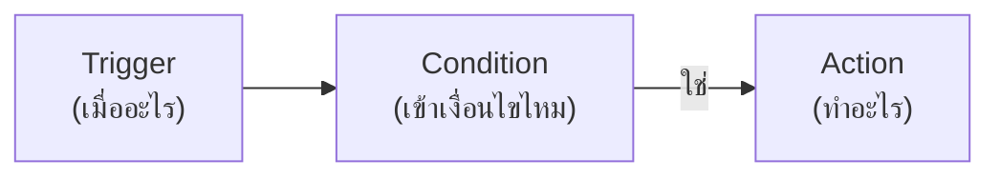

# Automations: กฎและเวิร์กโฟลว์อัตโนมัติ

Automation ใน Raina ช่วยเปลี่ยนข้อมูลที่อุปกรณ์ส่งเข้ามาให้กลายเป็นการกระทำจริงในโลกกายภาพ โดยสร้างขึ้นในรูปแบบกราฟเวิร์กโฟลว์ที่เชื่อมต่อบล็อกเข้าด้วยกัน เมื่อมีเหตุการณ์หรือเงื่อนไขตามที่กำหนด ระบบจะเข้ามารับช่วงทำงานต่อทันที เช่น เมื่ออุณหภูมิในโรงเรือนสูงเกิน 30 องศา ให้สั่งเปิดพัดลมระบายอากาศ พร้อมทั้งส่งข้อความแจ้งเตือนเข้ากลุ่ม Telegram ไปพร้อมกัน

คุณสามารถเริ่มสร้างเวิร์กโฟลว์ได้ที่หน้า **Automations** ในโปรเจกต์ โดยกดปุ่ม **New automation** จากนั้นลากบล็อกจากแถบเครื่องมือมาวางลงบน Canvas เชื่อมเส้นการทำงาน และกดปุ่ม **Run** เพื่อทดสอบเวิร์กโฟลว์ได้ทันทีตั้งแต่ตอนออกแบบ

<!-- Screenshot:
ภาพ: ตัวแก้ไข automation
ควรแสดง: บล็อก trigger ต่อเข้า condition แล้วแยกไป action พร้อมแผง inspector ของบล็อกที่เลือก
-->

## คลังบล็อกและหน้าที่การทำงาน

เวิร์กโฟลว์ของ Raina ขับเคลื่อนด้วยบล็อก 3 ประเภทหลัก ได้แก่ Trigger สำหรับเริ่มต้น, Condition สำหรับแยกทางตัดสินใจ และ Action สำหรับลงมือปฏิบัติการ

### Trigger (จุดเริ่มต้นของเวิร์กโฟลว์)

เวิร์กโฟลว์ทุกตัวจะต้องมี Trigger อย่างน้อยหนึ่งตัวเพื่อกำหนดว่าเหตุการณ์ใดที่จะปลุกให้ระบบเริ่มทำงาน

| บล็อก | กรณีการใช้งาน | ค่าที่ต้องกำหนด |
| :--- | :--- | :--- |
| Variable | ทำงานเมื่อค่าตัวแปรถึงเกณฑ์ที่ตั้งไว้ หรือมีค่าเปลี่ยนแปลง | ชื่อ Variable, อุปกรณ์ (หากเว้นว่างไว้จะติดตามจากทุกตัว), ตัวดำเนินการเงื่อนไข (`>`, `<`, `>=`, `<=`, `==`, `!=`, `changed`), ค่าเป้าหมาย, Cooldown (หน่วงเวลาป้องกันการสั่งงานซ้ำซ้อน หน่วยเป็นวินาที) |
| Manual | รันเวิร์กโฟลว์ด้วยตัวเอง | ไม่ต้องตั้งค่า — ใช้กดปุ่ม Run บนหน้าจอ |
| Schedule | ทำงานตามเวลาที่กำหนดเป็นประจำ | เวลาที่ต้องการรัน (HH:MM), วันในสัปดาห์ (หากเว้นว่างไว้จะทำงานทุกวัน), Timezone |
| Solar | ทำงานสัมพันธ์กับพระอาทิตย์ขึ้นหรือตก | เลือก Sunrise หรือ Sunset, พิกัดละติจูด/ลองจิจูด, ระยะเวลาชดเชย (หน่วยเป็นนาที) |
| Event | ทำงานเมื่อเกิดอีเวนต์ภายในระบบตามชื่อที่ระบุ | ชื่อ Event ที่ต้องการรอรับ (เช่น `button_pressed`) |

### Condition (จุดแยกการตัดสินใจ)

Condition จะนำข้อมูลมาตรวจสอบเงื่อนไขก่อนที่จะให้เวิร์กโฟลว์เดินหน้าต่อ โดยจะแยกผลลัพธ์ออกเป็นเส้นทางกรณีที่เป็นจริง (True) และกรณีที่เป็นเท็จ (False)

| บล็อก | กรณีการใช้งาน | ค่าที่ต้องกำหนด |
| :--- | :--- | :--- |
| If variable | ตรวจสอบค่าตัวแปรก่อนทำขั้นต่อไป | ชื่อ Variable, ตัวดำเนินการเปรียบเทียบ (`>`, `<`, `>=`, `<=`, `==`, `!=`), ค่าที่ใช้เทียบ |
| Time window | กรองให้คำสั่งทำงานเฉพาะในช่วงเวลาที่ระบุ | เวลาเริ่มต้นและสิ้นสุด (รองรับช่วงเวลาข้ามคืน เช่น 22:00 ถึง 06:00), วันในสัปดาห์, Timezone |

### Action (คำสั่งปฏิบัติการ)

เมื่อผ่านเงื่อนไขเข้ามาแล้ว Action จะเป็นส่วนที่สั่งการให้เกิดผลลัพธ์จริง ไม่ว่าจะเป็นการสั่งอุปกรณ์หรือส่งข้อมูลออกภายนอก

| บล็อก | กรณีการใช้งาน | ค่าที่ต้องกำหนด |
| :--- | :--- | :--- |
| Set value | เขียนค่าลงตัวแปร หรือส่งคำสั่งควบคุมไปยังอุปกรณ์ | ชื่อ Variable, อุปกรณ์ปลายทาง (หากเว้นว่างไว้จะสั่งกลับไปยังอุปกรณ์ที่กระตุ้น Trigger), ค่าที่ต้องการเขียน (สามารถใช้ `{{value}}` เพื่อดึงค่าที่กระตุ้น Trigger มาใช้ได้) |
| Integration | ยิงแจ้งเตือนหรือเรียกใช้งานบริการภายนอก | เลือก Integration ที่ตั้งค่าไว้แล้วในระบบ |
| Emit | ปล่อยอีเวนต์ภายในระบบ เพื่อส่งต่อให้ Automation ตัวอื่นทำงานต่อ | ชื่อ Event |
| Delay | หน่วงเวลาไว้ชั่วคราวก่อนเริ่มทำงานบล็อกถัดไป | ระยะเวลา พร้อมระบุหน่วย (วินาที, นาที หรือชั่วโมง) |

> ในช่องข้อความแจ้งเตือน คุณสามารถแทรกตัวแปรเพื่อดึงค่าจริงขณะรันมาแสดงผลได้ เช่น การพิมพ์ว่า `"อุณหภูมิปัจจุบัน {{value}} °C"` ระบบจะแทนที่ `{{value}}` ด้วยตัวเลขอุณหภูมิจริงที่ส่งเข้ามาในรอบนั้นโดยอัตโนมัติ

## ตัวอย่างการสร้าง: เมื่อร้อนเกิน 30°C ให้เปิดพัดลมและแจ้ง Telegram

เพื่อให้เห็นภาพการเชื่อมต่อบล็อก ลองดูตัวอย่างเวิร์กโฟลว์เฝ้าระวังโรงเรือน ซึ่งมีขั้นตอนการประกอบกราฟดังนี้

1. ลากบล็อก Trigger ชนิด **Variable** มาวาง ตั้งค่าชื่อตัวแปรเป็น `temperature` เลือกเงื่อนไขมากกว่า (`>`) และใส่ค่าเป้าหมายเป็น `30`
2. ลากบล็อก Action ชนิด **Set value** มาวางต่อจาก Trigger กำหนดชื่อตัวแปรเป็น `fan_speed` และใส่ค่าเป็น `100` หากอุปกรณ์ของคุณเชื่อมต่อผ่านโปรโตคอล RLP อยู่ คำสั่งเปิดพัดลมนี้จะถูกส่งตรงไปยังบอร์ดทันที
3. ลากบล็อก Action ชนิด **Integration** มาวางขนานกัน แล้วเลือกช่องทาง Telegram ที่คุณผูกไว้ล่วงหน้า พร้อมใส่ข้อความเตือนภัย
4. เมื่อต่อเส้นเชื่อมโยงครบแล้ว ให้กดบันทึก จากนั้นกดปุ่ม **Run** เพื่อทดลองรันดูว่าพัดลมได้รับคำสั่งและมีข้อความเข้า Telegram หรือไม่ เมื่อตรวจสอบเรียบร้อยแล้ว ให้เปิดสวิตช์ทำงานจริง

> หากคุณเปิดใช้งาน TypeSafe ไว้ คุณสามารถกดปุ่ม **Describe** แล้วพิมพ์สิ่งที่ต้องการเป็นประโยคข้อความธรรมดาได้เลย ระบบจะช่วยร่างโครงสร้างของกราฟและต่อบล็อกให้โดยอัตโนมัติ คุณเพียงแค่ตรวจทานความถูกต้องก่อนเปิดใช้งาน

## ตรวจสอบประวัติการรันและแก้ปัญหา

ในหน้ารวม Automation คุณสามารถดูภาพรวมได้ทันทีว่าเวิร์กโฟลว์แต่ละตัวทำงานรอบล่าสุดเมื่อไหร่ และผลลัพธ์เป็นอย่างไรระหว่าง `ok`, `error` หรือ `skipped`

เมื่อคลิกเข้าไปดูในแท็บ **Runs** ระบบจะแสดงรายละเอียดการไหลของข้อมูลในแต่ละบล็อกอย่างชัดเจน พร้อมแสดงค่า Input และ Output ที่ส่งหากัน หากรอบใดทำงานไม่สำเร็จ บล็อกที่มีปัญหาจะเปลี่ยนเป็นสีแดงเตือนทันที และคุณสามารถกดปุ่ม **Retry** เพื่อสั่งให้ระบบลองทำงานต่อจากบล็อกที่ล้มเหลวได้ทันทีโดยไม่ต้องเริ่มต้นรอบใหม่ตั้งแต่ต้น

สำหรับบล็อกประเภท Action ที่เป็นการเรียกบริการภายนอก หากเกิดปัญหาเรื่องเครือข่ายขัดข้อง ระบบจะพยายามส่งซ้ำให้อัตโนมัติสูงสุด 3 ครั้ง และในกรณีที่มีการใช้บล็อก **Delay** เป็นเวลานานหลายนาทีหรือหลายชั่วโมง Raina จะจัดเก็บสถานะของงานไว้ในฐานข้อมูลและปลุกขึ้นมาทำต่อเมื่อถึงเวลา คุณจึงสามารถปิดหน้าเว็บทิ้งไว้ได้โดยที่งานไม่สูญหาย

ข้อควรระวังสำคัญคือ เมื่อ Action มีการสั่งเขียนค่าลงในตัวแปร ค่านั้นอาจไปกระตุ้นให้ Automation ตัวอื่นที่คอยฟังตัวแปรเดียวกันเริ่มทำงานต่อเป็นทอด ๆ เพื่อป้องกันไม่ให้เกิดลูปการทำงานวนซ้ำไม่รู้จบ Raina มีระบบป้องกัน Infinite Loop ในตัว โดยจำกัดการส่งต่อของ Telemetry ไว้ไม่เกิน 5 ชั้น และ Event ภายในไม่เกิน 3 ชั้น

สุดท้าย อย่าลืมตรวจดูเสมอว่าสวิตช์เปิดใช้งาน (Enabled) ของเวิร์กโฟลว์เปิดอยู่ เพราะเวิร์กโฟลว์ที่เพิ่งสร้างใหม่หรือเพิ่งแก้ไขมักจะถูกบันทึกไว้ในสถานะปิดเพื่อความปลอดภัยก่อนเสมอ

คุณสามารถศึกษาช่องทางการส่งข้อความแจ้งเตือนเพิ่มเติมได้ที่ [Integrations](./integrations.md) หรือทดลองทำเวิร์กช็อปจริงได้ใน [Tutorial ครบวงจร](./tutorials.md)
