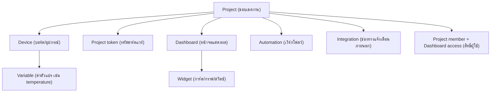

# Concepts: คำศัพท์และโมเดลของ Raina

ก่อนจะเริ่มลงมือสร้างระบบ IoT บน Raina การทำความเข้าใจโมเดลข้อมูลและคำศัพท์หลักจะช่วยให้คุณมองเห็นภาพว่าชิ้นส่วนต่าง ๆ ทำงานประสานกันอย่างไร แต่ละแนวคิดที่กล่าวถึงในเอกสารนี้เป็นตัวแทนของทรัพยากรที่มีอยู่จริงในระบบ

## แผนที่ทรัพยากร

## Project

Project เป็นหน่วยขอบเขตการทำงานที่ใหญ่ที่สุดใน Raina ทำหน้าที่แยกแยะงานตามไซต์งาน ลูกค้า หรือพื้นที่ติดตั้ง เช่น "โรงเรือนปลูกผักแปลง A" หรือ "โรงงานโซน 2"

ทรัพยากรเกือบทั้งหมด ไม่ว่าจะเป็นตัวอุปกรณ์ ตัวแปร กุญแจ Token หน้าจอ Dashboard เวิร์กโฟลว์ของ Automation ตลอดจนการเชื่อมต่อไปยังระบบภายนอก จะต้องสังกัดอยู่ภายใต้ Project ใดโปรเจกต์หนึ่งเสมอ ข้อมูลระหว่างแต่ละโปรเจกต์จะถูกแยกขาดจากกันโดยสิ้นเชิง ทำให้คุณสามารถดูแลหลายไซต์งานบนเซิร์ฟเวอร์ตัวเดียวกันได้โดยไม่มีข้อมูลปะปนกัน

## Device

Device หมายถึงตัวตนของอุปกรณ์ฮาร์ดแวร์หรือโหนดส่งข้อมูลในโลกจริง เช่น บอร์ดไมโครคอนโทรลเลอร์ ESP32 แต่ละตัว หรือคอมพิวเตอร์บอร์ดเดี่ยวที่ทำหน้าที่เป็นเกตเวย์

สิ่งที่สะดวกในการใช้งาน Raina คือคุณไม่จำเป็นต้องเข้ามาสร้าง Device ล่วงหน้าบนหน้าเว็บ เมื่ออุปกรณ์เครื่องใดก็ตามเริ่มส่งข้อมูล Telemetry เข้ามาเป็นครั้งแรกพร้อมกับระบุชื่อประจำตัวผ่านฟิลด์ `deviceId` หรือ `device_id` ควบคู่กับ Token ที่ถูกต้อง ระบบจะบันทึกอุปกรณ์ตัวใหม่นี้เข้าสู่ Project ให้อัตโนมัติทันที

ในการตั้งชื่ออุปกรณ์ คุณสามารถใช้ตัวอักษรภาษาอังกฤษทั้งตัวพิมพ์เล็กและพิมพ์ใหญ่ ตัวเลข รวมถึงเครื่องหมายขีดล่าง ขีดกลาง และจุด (`a-z A-Z 0-9 _ . -`) โดยมีความยาวได้สูงสุด 64 ตัวอักษร และเมื่ออุปกรณ์ตัวนั้นถูกลงทะเบียนเข้ากับ Token ใดไปแล้ว อุปกรณ์นั้นจะผูกพันกับ Token ดังกล่าวเพื่อความปลอดภัย

## Project token (hardware token)

Project token เป็นรหัสลับที่ออกให้กับแต่ละโปรเจกต์ เพื่อให้อุปกรณ์นำไปใช้ยืนยันตัวตนกับ Raina เมื่อต้องการเชื่อมต่อ Socket หรือส่งข้อมูลเข้ามาทาง API

คุณสามารถออก Token ใหม่ได้จากหน้า Devices ของโปรเจกต์ โดยกดปุ่ม **New token** จุดที่สำคัญมากคือระบบจะแสดงค่าจริงของ Token ให้เห็นเพียงครั้งเดียวตอนสร้างเท่านั้น คุณจึงต้องคัดลอกเก็บไว้ทันที เนื่องจากในฐานข้อมูลของ Raina จะบันทึกเฉพาะค่าแฮชเท่านั้น หาก Token สูญหาย คุณจะไม่สามารถกู้คืนค่าเดิมได้ แต่จะต้องสร้าง Token ใหม่ขึ้นมาแทน แล้วกดปุ่ม **Revoke** เพื่อยกเลิก Token เก่าทิ้งไป

## Variable (ตัวแปร)

Variable คือชื่อกำกับของข้อมูลแต่ละค่าที่อุปกรณ์ส่งเข้ามาหรือรับกลับไป เช่น `temperature`, `humidity` หรือสถานะรีเลย์อย่าง `pump_relay` ตัวแปรใน Raina จะมีตัวตนอยู่ภายใต้คู่ของ Project และ Device เสมอ นั่นแปลว่าอุปกรณ์ต่างตัวกันภายในโปรเจกต์เดียวกันสามารถส่งตัวแปรชื่อ `temperature` เหมือนกันได้โดยที่ข้อมูลจะไม่ชนกัน

ระบบจะจัดการตัวแปรออกเป็นสองรูปแบบตามลักษณะการใช้งาน สำหรับการแสดงผลสถานะปัจจุบันบนหน้าจอและนำไปประเมินเงื่อนไขใน Automation ระบบจะเก็บ "ค่าล่าสุด" เอาไว้ให้อ่านได้ทันที ส่วนข้อมูลประเภทตัวเลข ระบบจะบันทึกประวัติย้อนหลังลงฐานข้อมูลแบบ Time-Series ควบคู่ไปด้วย เพื่อให้คุณสามารถดึงไปวาดกราฟดูแนวโน้มได้

ในการตั้งชื่อตัวแปร คุณต้องใช้ตัวอักษรภาษาอังกฤษ ตัวเลข หรือเครื่องหมาย `a-z A-Z 0-9 _ . -` ความยาวไม่เกิน 64 ตัวอักษร ข้อมูลแต่ละค่าต้องมีความยาวไม่เกิน 512 ไบต์ และสามารถส่งได้สูงสุด 50 ตัวแปรต่อการส่งข้อมูลหนึ่งครั้ง หากข้อมูลที่ส่งเข้ามาไม่ใช่ตัวเลข เช่น ข้อความสถานะหรือค่าบูลีน ระบบจะเก็บไว้เฉพาะค่าล่าสุดสำหรับแสดงผลและใช้ในเงื่อนไข แต่จะไม่สามารถนำไปพล็อตเป็นกราฟเส้นย้อนหลังได้

## Dashboard และ Widget

Dashboard เป็นพื้นที่สำหรับจัดวางหน้าจอมอนิเตอร์และแผงสั่งงาน โดยคุณสามารถนำ Widget ขนาดต่าง ๆ มาวางลงบนกริดได้อย่างอิสระ แต่ละ Dashboard สามารถกำหนดรูปแบบการเข้าถึงได้ 3 โหมดผ่านเมนู **Share dashboard**

| โหมด | รายละเอียด |
| :--- | :--- |
| Public access | ใครก็ตามที่มีลิงก์สามารถเปิดดูได้ทันที ไม่จำเป็นต้องล็อกอิน |
| Restricted access | ต้องล็อกอินด้วยบัญชีผู้ใช้ที่มีสิทธิ์เข้าถึงหน้านี้เท่านั้น |
| Paused | ระงับการเข้าถึงชั่วคราว ลิงก์เดิมจะยังคงอยู่แต่เปิดดูไม่ได้จนกว่าจะเปิดใหม่ |

หากเลือกแชร์แบบสาธารณะ ลิงก์ที่ได้จะอยู่ในรูปแบบ `/public/d/<token>` ซึ่งเปิดดูได้โดยไม่ต้องมีบัญชีในระบบ

ส่วนตัว Widget มีทั้งหมด 8 ชนิด โดยแบ่งกลุ่มตามการใช้งานออกเป็นสองประเภท คือกลุ่มที่ใช้สำหรับอ่านค่าแสดงผล และกลุ่มที่ใช้สำหรับส่งคำสั่งควบคุม

| กลุ่ม | วิดเจ็ต |
| :--- | :--- |
| Monitor (อ่านค่าแสดงผล) | Value, Chart, Gauge, Percentage |
| Control (ส่งคำสั่งควบคุม) | Toggle, Push, Slider, Color |

Widget ในกลุ่ม Control แต่ละตัวจะผูกเข้ากับชื่อตัวแปรหนึ่งชื่อ เมื่อผู้ใช้กดปุ่ม เลื่อนแถบ หรือเปลี่ยนสีบนหน้าจอ Raina จะส่งค่านั้นกลับไปยังอุปกรณ์จริงทันทีเพื่อให้อุปกรณ์ปรับเปลี่ยนการทำงานตามคำสั่ง

## Automation

Automation คือระบบเวิร์กโฟลว์แบบกราฟที่คอยเฝ้าระวังและทำงานแทนคุณเมื่อเกิดเงื่อนไขที่กำหนดไว้ โดยสร้างขึ้นจากการนำบล็อกมาเชื่อมต่อกันเป็นเส้นทางการทำงาน ซึ่งประกอบด้วยสามส่วนหลัก

ส่วนแรกคือ Trigger หรือตัวเริ่มต้นเวิร์กโฟลว์ ซึ่งอาจเกิดจากค่าตัวแปรเปลี่ยนแปลงหรือแตะเกณฑ์ที่ตั้งไว้ การกดสั่งรันเองจากหน้าจอ การตั้งเวลาให้ทำงานตามตารางประจำวัน การคำนวณตามเวลาพระอาทิตย์ขึ้นพระอาทิตย์ตก หรือการรอรับอีเวนต์ที่ถูกส่งมาจากเวิร์กโฟลว์ตัวอื่น

ส่วนถัดมาคือ Condition หรือทางแยกการตัดสินใจ ซึ่งจะตรวจสอบว่าค่าตัวแปรหรือช่วงเวลาขณะนั้นตรงตามเงื่อนไขที่ระบุไว้หรือไม่ ก่อนจะแยกการทำงานออกเป็นสองเส้นทางระหว่างกรณีที่เป็นจริงและกรณีที่เป็นเท็จ

ส่วนสุดท้ายคือ Action หรือคำสั่งปฏิบัติการ เช่น การเขียนค่าใหม่กลับลงไปในตัวแปรเพื่อสั่งงานอุปกรณ์ การเรียกใช้งาน Integration เพื่อส่งข้อความแจ้งเตือนออกไปยังบริการภายนอก การปล่อยอีเวนต์ภายในระบบเพื่อให้เวิร์กโฟลว์อื่นทำงานต่อ หรือการสั่งหน่วงเวลาไว้ก่อนที่จะเริ่มคำสั่งถัดไป

ทุกครั้งที่เวิร์กโฟลว์ทำงาน ระบบจะบันทึกประวัติการรันแต่ละรอบไว้อย่างละเอียด ทำให้คุณสามารถคลิกดูย้อนหลังได้ว่าบล็อกไหนทำงานผ่านหรือเกิดข้อผิดพลาด และหากพบจุดที่ติดขัด คุณก็สามารถกดสั่งให้ระบบทำงานต่อจากบล็อกนั้นใหม่ได้ทันที

## Integration

Integration คือตัวกลางสำหรับเชื่อมต่อ Raina ออกไปยังบริการภายนอก เพื่อให้ระบบสามารถส่งข้อความแจ้งเตือนหรือยิง Webhook ไปยังแพลตฟอร์มอื่นได้ ปัจจุบันระบบรองรับช่องทางยอดนิยมทั้งหมด 8 ชนิด ได้แก่ HTTP service, Email ผ่านบริการของ Resend, Telegram, Slack, Discord, Twilio สำหรับ SMS หรือ WhatsApp, Microsoft Teams และ PagerDuty

เพื่อความปลอดภัยของระบบ ข้อมูลลับทั้งหมดที่คุณใช้เชื่อมต่อ ไม่ว่าจะเป็น Bot Token, Webhook URL หรือ API Key จะได้รับการเข้ารหัสก่อนบันทึกลงในฐานข้อมูล และบนหน้าจอจะแสดงผลแบบปกปิดไว้เสมอ

## ผู้ใช้และสิทธิ์การใช้งาน

ระดับสิทธิ์ของผู้ใช้งานใน Raina ถูกแบ่งออกเป็นสองระดับหลัก ในระดับทั้งระบบ บัญชีจะถูกแบ่งเป็น 4 บทบาท โดย Owner, Admin และ Staff จะเป็นกลุ่มทีมดูแลระบบที่สามารถมองเห็นและจัดการโปรเจกต์ทั้งหมดได้ ส่วนบทบาท Client จะเป็นบัญชีสำหรับลูกค้าหรือผู้ใช้ภายนอก ซึ่งจะมองเห็นได้เฉพาะโปรเจกต์ที่ได้รับเชิญเท่านั้น

เมื่อมองลึกลงมาในระดับแต่ละโปรเจกต์ คุณยังสามารถกำหนดขอบเขตได้อย่างเจาะจงว่าสมาชิกคนนั้นจะมองเห็น Dashboard ทั้งหมดหรือเห็นได้เฉพาะบางหน้าที่ระบุ และในแต่ละหน้ายังเลือกล็อกได้อีกว่าผู้ใช้นั้นมีสิทธิ์ส่งคำสั่งควบคุมอุปกรณ์ หรือทำได้เพียงแค่นั่งดูข้อมูลอย่างเดียว

## Realtime

เมื่อคุณเปิดหน้า Dashboard ทิ้งไว้บนเบราว์เซอร์ ข้อมูลบนหน้าจอจะขยับและอัปเดตเองโดยอัตโนมัติทันทีที่มีการเปลี่ยนแปลง โดยเบราว์เซอร์จะพยายามเชื่อมต่อผ่าน WebSocket เป็นช่องทางแรกเพื่อให้รับส่งข้อมูลได้เร็วที่สุด แต่หากเครือข่ายของคุณมีการบล็อก WebSocket ระบบจะสลับไปใช้ Server-Sent Events ให้เองโดยอัตโนมัติ ทำให้การแสดงผลข้อมูลยังคงเป็นแบบเรียลไทม์ได้อย่างต่อเนื่องโดยที่คุณไม่ต้องปรับแต่งอะไรเพิ่มเติม

คุณสามารถเริ่มต้นลงมือสร้างระบบจริงได้ที่ [Getting started](./getting-started.md) หรืออ่านรายละเอียดการตั้งค่าสมาชิกใน [Projects และสิทธิ์ผู้ใช้](./projects-and-access.md)
