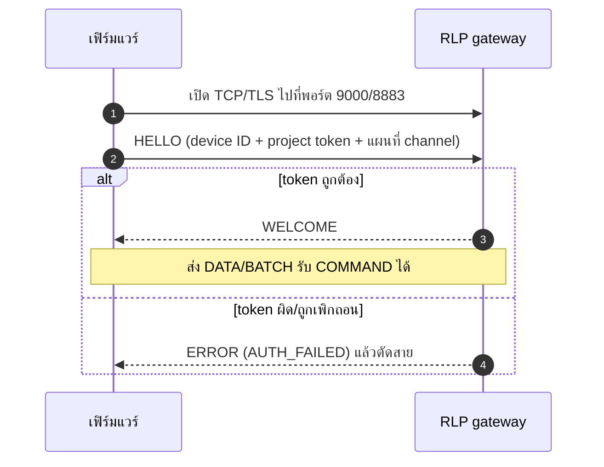

# RLP และเฟิร์มแวร์ (ESP32 / Arduino)

RLP v1 หรือ Raina Link Protocol คือโปรโตคอลการสื่อสารหลักที่ออกแบบมาสำหรับอุปกรณ์ไมโครคอนโทรลเลอร์โดยเฉพาะ แทนที่จะต้องใช้โปรโตคอลขนาดใหญ่อย่าง MQTT ตัว RLP จะเปิดการเชื่อมต่อแบบไบนารีเพียงเส้นเดียวบน TCP หรือ TLS ซึ่งสายเส้นนี้จะทำหน้าที่ครบทุกอย่าง ตั้งแต่การส่งข้อมูล Telemetry จากเซ็นเซอร์ การรอรับคำสั่งควบคุมจากเซิร์ฟเวอร์ การตอบรับสถานะคำสั่ง (ACK) ตลอดจนการส่งสัญญาณ Heartbeat เลี้ยงคอนเนกชัน

เมื่อรันระบบบนเครื่องสำหรับพัฒนาหรือเครือข่ายภายใน (LAN) คุณสามารถเชื่อมต่อผ่านพอร์ต TCP ธรรมดาที่หมายเลข 9000 ได้โดยตรง แต่หากนำไปใช้งานจริงบน Production จะต้องเชื่อมต่อผ่านพอร์ต 8883 ซึ่งเข้ารหัสด้วย TLS เสมอ หากต้องการตรวจเช็กว่าระบบของคุณประกาศ Endpoint ไว้อย่างไร สามารถเรียกดูได้จาก `GET /v1/public/endpoints`

## วงจรการเชื่อมต่อ (Lifecycle)



เมื่ออุปกรณ์เริ่มเปิด Socket การสื่อสารระหว่างเฟิร์มแวร์กับ RLP Gateway จะเกิดขึ้นเป็นลำดับขั้นที่ชัดเจน

เริ่มต้นจากการส่งเฟรม `HELLO` ทันทีที่เปิด Socket สำเร็จ เฟิร์มแวร์จะต้องส่งเฟรมทักทายที่มี Device ID, Project Token ในรูปแบบข้อความดิบ และตารางจับคู่ระหว่างชื่อตัวแปรกับหมายเลข Channel ซึ่งเป็นตัวเลขจำนวนเต็มตั้งแต่ 1 ถึง 65535 หาก Token ถูกต้องและไม่มีข้อขัดแย้ง Gateway จะตอบกลับด้วยเฟรม `WELCOME` จากจุดนี้เป็นต้นไป อุปกรณ์ก็พร้อมจะส่งข้อมูล Telemetry และรอรับคำสั่งควบคุมได้ทันที

ในระหว่างที่เชื่อมต่ออยู่ เฟิร์มแวร์จะต้องส่งสัญญาณ `PING` ไปยังเซิร์ฟเวอร์เป็นระยะ เช่น ทุก ๆ 30 วินาทีตามตัวอย่างใน SDK เพื่อรักษาการเชื่อมต่อไว้ หากเซิร์ฟเวอร์ไม่ได้รับข้อมูลหรือการสื่อสารใด ๆ เลยเป็นเวลานานเกินกว่า 90 วินาที Gateway จะถือว่าอุปกรณ์หลุดและตัดการเชื่อมต่อทันที

เมื่อฝั่งเซิร์ฟเวอร์หรือผู้ใช้งานบน Dashboard กดสั่งงานอุปกรณ์ Gateway จะส่งเฟรม `COMMAND` ลงมาพร้อมกับรหัสคำสั่ง (Command ID) และค่าใหม่ที่ต้องการตั้ง เมื่อเฟิร์มแวร์ทำงานตามคำสั่งเรียบร้อยแล้ว จะต้องส่งเฟรม `ACK` ยืนยันกลับไปให้เซิร์ฟเวอร์เสมอ โดยส่งรหัสสถานะเป็นตัวเลข ซึ่งรหัส 0 หมายถึงทำงานสำเร็จ, 1 คือปฏิเสธคำสั่ง, 2 คืออุปกรณ์ไม่รองรับคำสั่งดังกล่าว และ 3 คือพยายามทำงานแล้วแต่เกิดข้อผิดพลาด ทั้งนี้ ข้อมูลในแต่ละเฟรมที่ส่งผ่าน RLP จะต้องมีขนาดไม่เกิน 16 KB หากส่งเฟรมขนาดใหญ่เกินกว่านี้ เซิร์ฟเวอร์จะปฏิเสธข้อมูลทันที

> **ทำไม RLP ถึงต้องใช้ Channel?**
> การที่ไมโครคอนโทรลเลอร์ต้องส่งชื่อตัวแปรแบบเต็มยาว ๆ เช่น `temperature_greenhouse_zone_1` ทุก ๆ ไม่กี่วินาที เป็นการสิ้นเปลืองทั้งหน่วยความจำและแบนด์วิดท์เครือข่าย RLP จึงแก้ปัญหานี้ด้วยการจับคู่ชื่อตัวแปรเข้ากับหมายเลข Channel สั้น ๆ เพียงครั้งเดียวในเฟรม HELLO หลังจากนั้น ทุกครั้งที่อุปกรณ์ส่งข้อมูล ก็เพียงแค่ส่งหมายเลข Channel คู่กับค่าตัวเลข ทำให้ข้อมูลมีขนาดเล็กมาก ประหยัดพลังงาน และประมวลผลได้อย่างรวดเร็ว

## เริ่มต้นอย่างรวดเร็วด้วย Arduino SDK

หากคุณใช้งานบอร์ด ESP32 หรือ ESP8266 เราได้เตรียม SDK ทางการไว้ให้แล้วในโฟลเดอร์ `sdks/arduino` ของ Repository นี้ คุณจึงสามารถเขียนโค้ดสั่งงานด้วยภาษา C++ ได้อย่างเป็นธรรมชาติโดยไม่ต้องยุ่งกับการจัดการไบนารีเฟรมด้วยตัวเอง

```cpp
#include <Raina.h>

const char* WIFI_SSID = "Farm WiFi";
const char* WIFI_PASS = "password";
const char* RAINA_HOST = "192.168.1.10";   // หรือโดเมนของคุณ
const char* PROJECT_ID = "proj_...";       // เก็บไว้เพื่อความเข้ากันได้ ไม่ได้ใช้ยืนยันตัว
const char* PROJECT_TOKEN = "your-hardware-token";
const char* DEVICE_ID = "greenhouse-01";

RAINA_ON("pump_relay") {
  digitalWrite(18, value.asBool() ? HIGH : LOW);
  Raina.send("pump_relay", value.asBool()); // รายงานสถานะจริงกลับ
}

void setup() {
  pinMode(18, OUTPUT);
  // สำหรับทดสอบในเครือข่ายแลน: ใช้พอร์ต 9000 (TCP)
  Raina.begin(WIFI_SSID, WIFI_PASS, RAINA_HOST, PROJECT_ID,
              PROJECT_TOKEN, DEVICE_ID, 9000);
}

void loop() {
  Raina.run(); // รักษา connection + รับคำสั่ง

  static unsigned long last = 0;
  if (millis() - last >= 5000) {
    last = millis();
    Raina.send("temperature", 28.5);
    Raina.send("humidity", 65.2);
  }
}
```

สำหรับการติดตั้งบน PlatformIO คุณสามารถเพิ่ม `lib_deps` ให้ชี้ตรงมายังโฟลเดอร์ `sdks/arduino` ได้ทันที ส่วนบน Arduino IDE ให้นำโฟลเดอร์ดังกล่าวมาบีบอัดเป็นไฟล์ ZIP แล้วติดตั้งผ่านเมนู Add .ZIP Library ได้เลย ตัวไลบรารีนี้ไม่มี Dependency ภายนอกอื่นใดเพิ่มเติม

สิ่งที่ควรคำนึงถึงในการพัฒนาเฟิร์มแวร์จริง:
ชื่อตัวแปรที่ส่งผ่าน `Raina.send()` จะต้องเป็นไปตามกฎของระบบ คือใช้ได้เฉพาะ `a-z A-Z 0-9 _ . -` และยาวไม่เกิน 64 ตัวอักษร หากคุณเตรียมอุปกรณ์สำหรับขึ้น Production คุณต้องเปลี่ยนไปใช้พอร์ต 8883 ร่วมกับการระบุใบรับรอง CA ผ่านคำสั่ง `setCACert` เพื่อความปลอดภัย และหลีกเลี่ยงการเชื่อมต่อแบบไม่เข้ารหัสนอกเครือข่ายที่ควบคุมได้

สำหรับพารามิเตอร์ `PROJECT_ID` ในฟังก์ชัน `begin()` นั้นมีไว้เพื่อรักษาความเข้ากันได้กับโค้ดรุ่นเดิม ตัวที่ใช้ยืนยันสิทธิ์จริงในระบบปัจจุบันคือ `PROJECT_TOKEN` และหากคุณต้องการเจาะจงหมายเลข Channel ของตัวแปรใดให้คงที่แน่นอน สามารถเรียกใช้ `setChannel("pump_relay", 7)` ก่อนสั่ง `begin()` ได้ หากไม่เรียก SDK จะจัดสรรหมายเลขให้อัตโนมัติ

## ทดสอบโดยไม่ต้องมีฮาร์ดแวร์ด้วย RLP Emulator

หากคุณยังไม่มีบอร์ดอยู่ในมือ คุณสามารถใช้สคริปต์ `scripts/emulator.ts` ที่อยู่ในโปรเจกต์ เพื่อจำลองบอร์ด ESP32 ที่เชื่อมต่อ RLP และส่งค่าอุณหภูมิความชื้นเข้ามาจริง ๆ ได้ทันที:

```bash
PROJECT_TOKEN=YOUR_HARDWARE_TOKEN DEVICE_ID=demo_esp32 pnpm emulate
```

คุณสามารถปรับพฤติกรรมของตัวจำลองผ่านตัวแปรสภาพแวดล้อมเพิ่มเติมได้ เช่น กำหนด `RLP_URL` เพื่อชี้ไปยังพอร์ตหรือโฮสต์อื่น (หากทดสอบ TLS ให้ใช้รูปแบบ `rlps://...` คู่กับ `RLP_CA_FILE` หรือเปิด `RLP_INSECURE=true` ในสภาพแวดล้อมทดสอบ) หรือกำหนด `INTERVAL_MS` เพื่อเปลี่ยนความถี่ในการสตรีมข้อมูล

## ตรวจสอบสถานะการเชื่อมต่อของอุปกรณ์

เมื่ออุปกรณ์หรือตัวจำลองเริ่มรันแล้ว คุณสามารถตรวจเช็กความพร้อมได้ตามลำดับนี้:

อันดับแรก ให้เปิดหน้า **Devices** ในโปรเจกต์ อุปกรณ์ชื่อใหม่จะต้องปรากฏขึ้นในรายการพร้อมแสดงเวลา `lastSeen` ที่เป็นปัจจุบัน ต่อมา ให้เปิดหน้า Dashboard ที่มี Widget ผูกกับตัวแปรนั้นไว้ คุณควรจะเห็นค่าตัวเลขและกราฟขยับตามรอบเวลาที่ส่ง และสุดท้าย ให้ลองกดส่งคำสั่งจาก Widget ควบคุม เช่น สวิตช์ Toggle แล้วสังเกตว่าอุปกรณ์ตอบสนองและส่ง ACK กลับมาอย่างถูกต้องหรือไม่

หากพบว่าอุปกรณ์ไม่ปรากฏหรือไม่มีการตอบสนอง สามารถดูแนวทางวิเคราะห์ปัญหาได้ที่ [Troubleshooting](./troubleshooting.md) หรือศึกษาการจัดวางหน้าจอมอนิเตอร์ต่อได้ใน [Dashboards](./dashboards.md)
